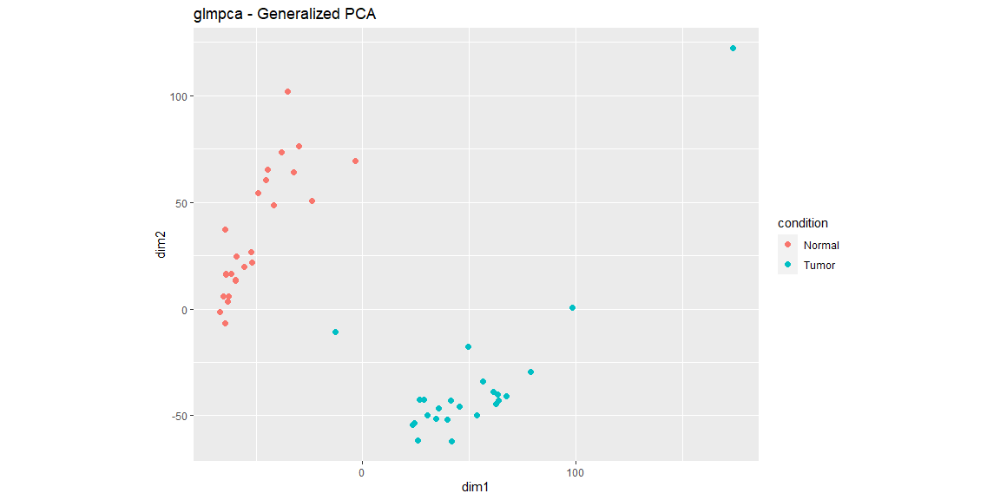
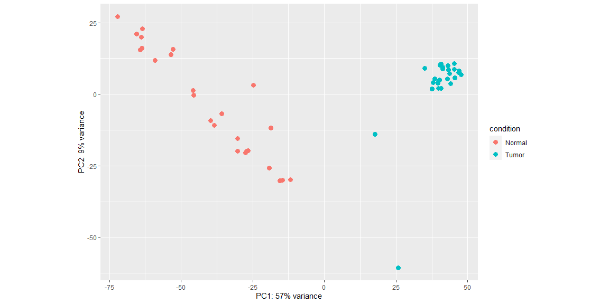
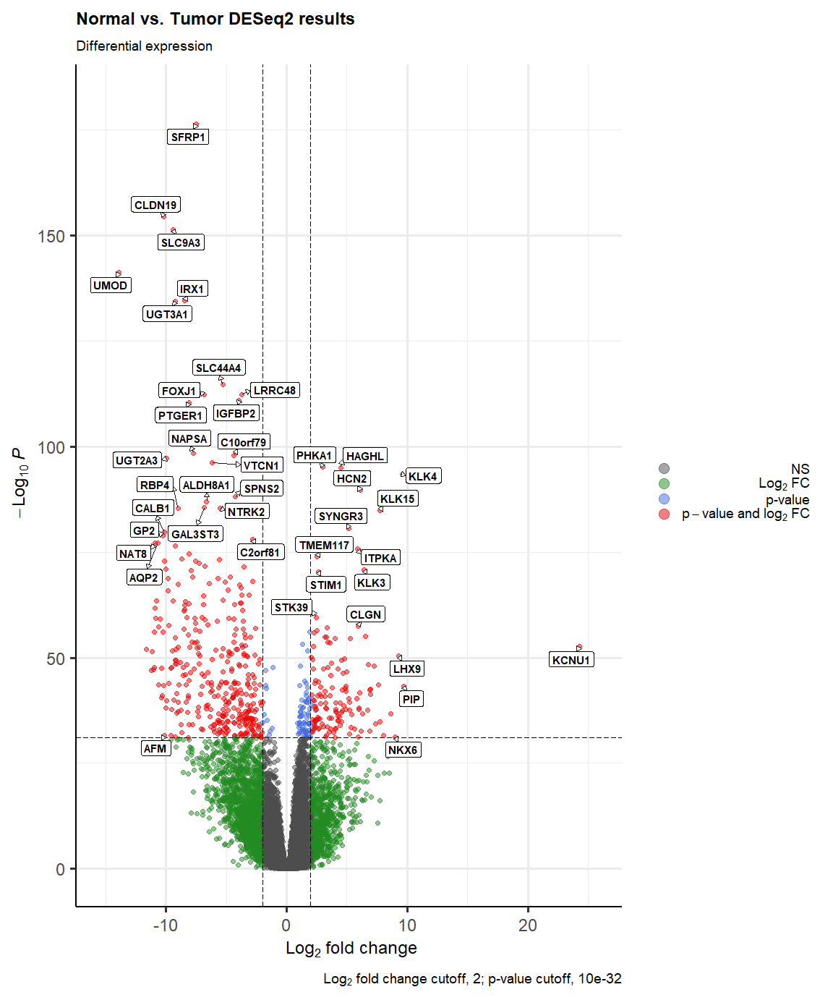
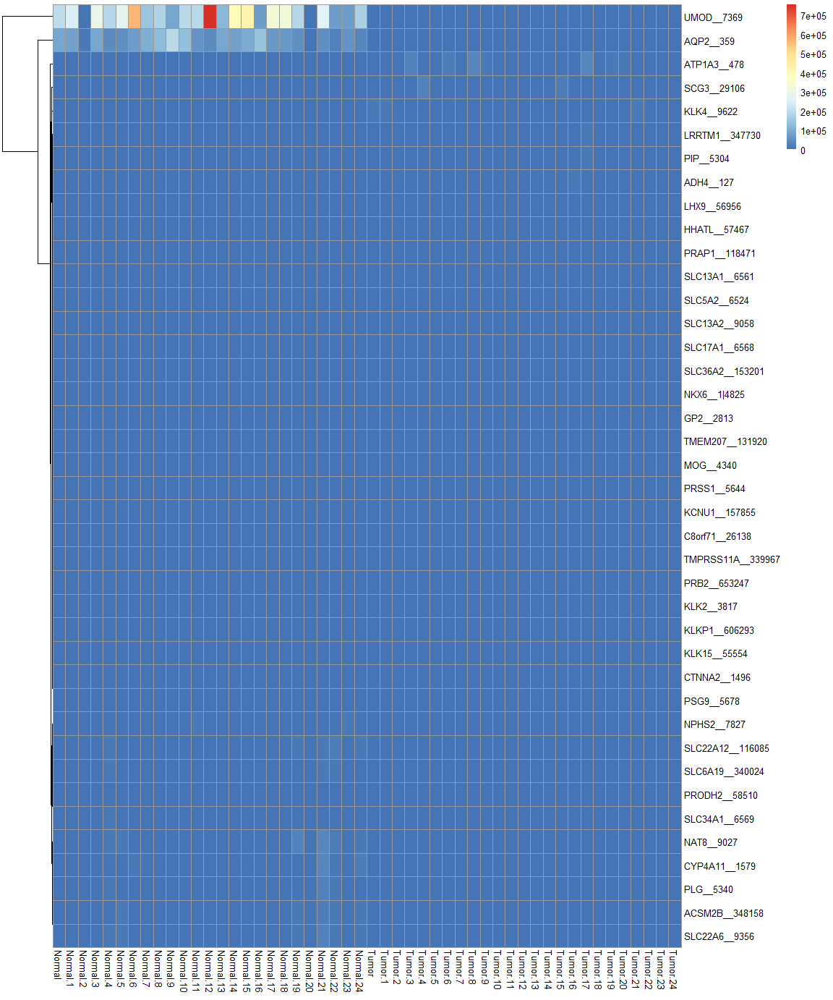
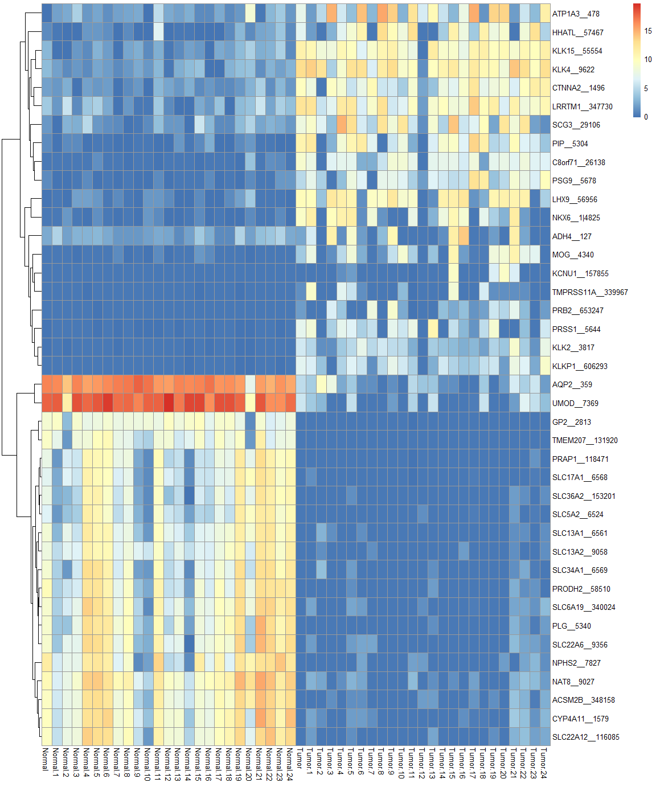
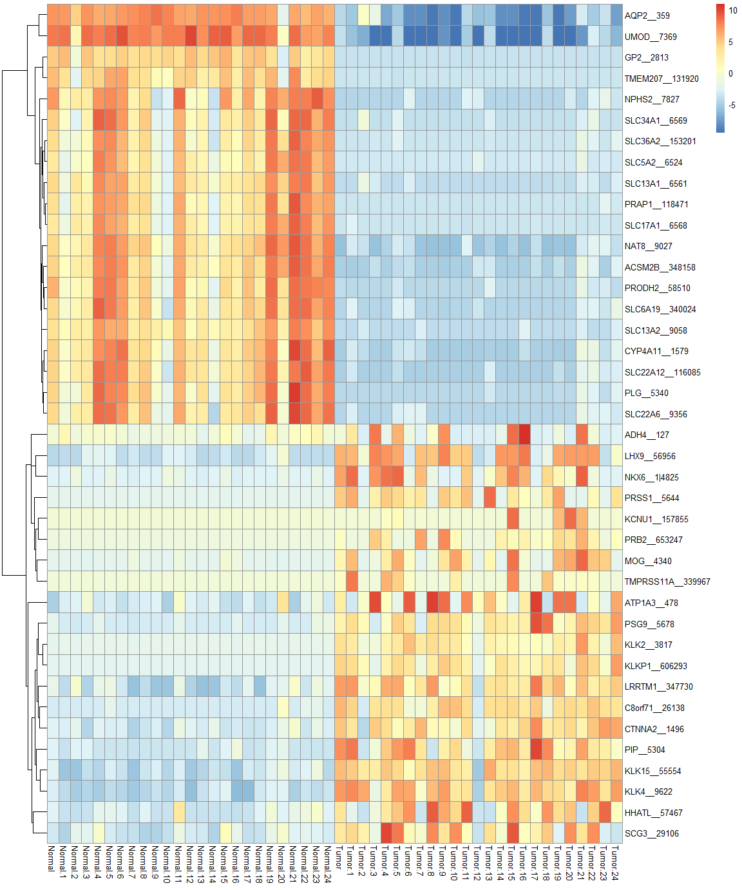
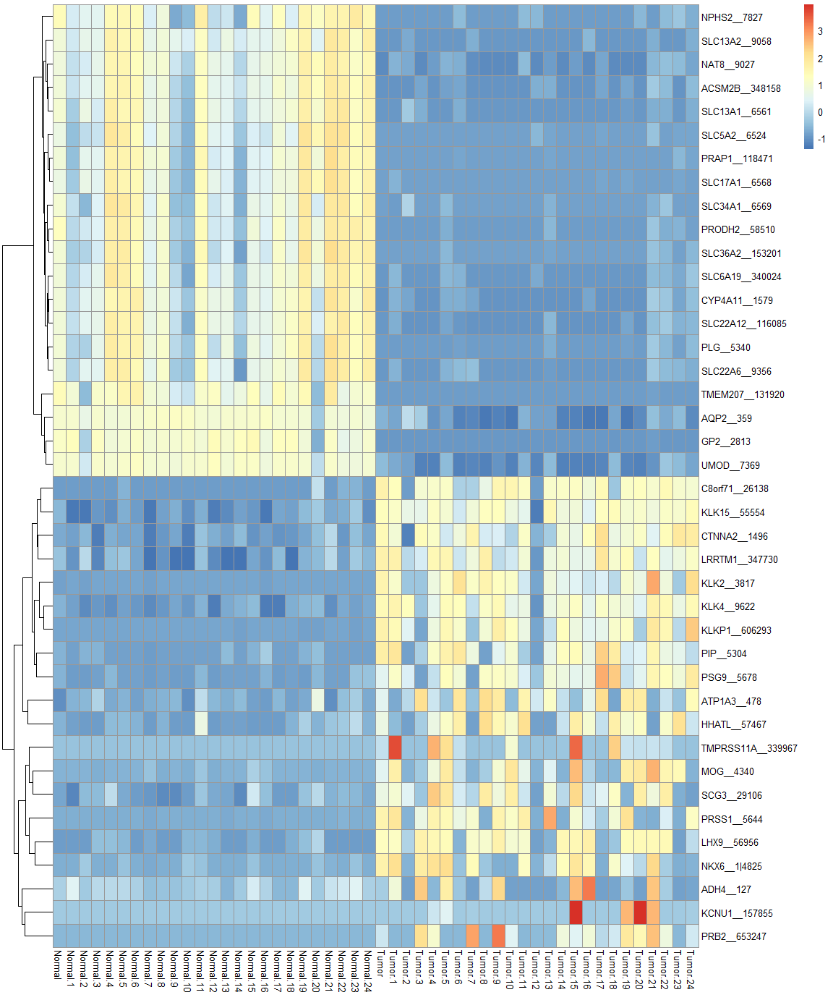
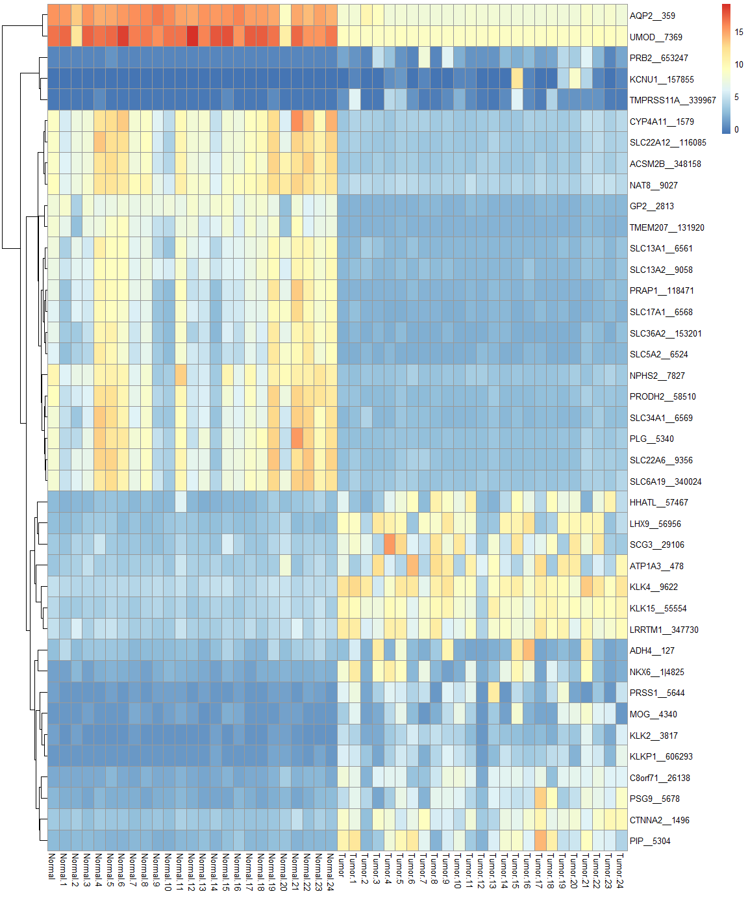
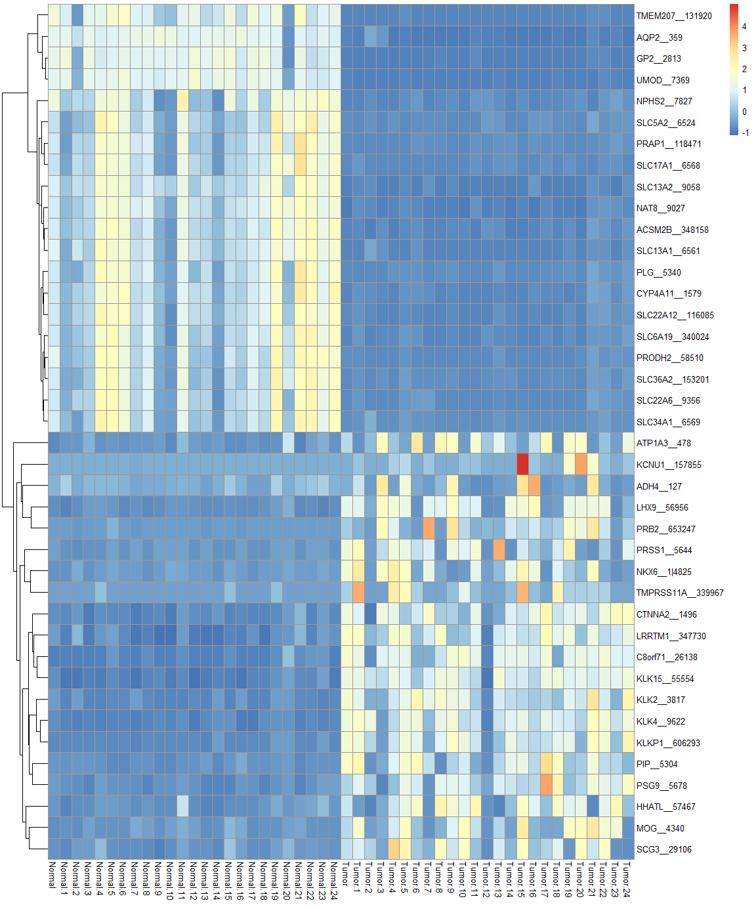

RNA-Sequencing Analysis using DESeq2
================
Oliver Hölsken
7 12 2021

## Load RDS

``` r
Expression_data <- readRDS("D:/Google Drive/8_MDS/KW3/Course_MDS/example_KICH.rda")
```

## Preparing the workspace

### Install Bioconductor

``` r
if(!requireNamespace("BiocManager", quietly = TRUE))
  install.packages("BiocManager")
BiocManager::install(version = "3.14")
```

    ## Bioconductor version 3.14 (BiocManager 1.30.16), R 4.1.2 (2021-11-01)

    ## Old packages: 'digest', 'ggrastr', 'Matrix'

### Install required BioConductor packages

``` r
BiocManager::install(c('DESeq2', 'glmpca', 'EnhancedVolcano'))
```

    ## Bioconductor version 3.14 (BiocManager 1.30.16), R 4.1.2 (2021-11-01)

    ## Warning: package(s) not installed when version(s) same as current; use `force = TRUE` to
    ##   re-install: 'DESeq2' 'glmpca' 'EnhancedVolcano'

    ## Old packages: 'digest', 'ggrastr', 'Matrix'

``` r
library(BiocManager)

library(ggplot2)
library(ggrepel)
library(genefilter)

library(dplyr)
```

    ## 
    ## Attache Paket: 'dplyr'

    ## Die folgenden Objekte sind maskiert von 'package:stats':
    ## 
    ##     filter, lag

    ## Die folgenden Objekte sind maskiert von 'package:base':
    ## 
    ##     intersect, setdiff, setequal, union

``` r
library(tibble)
library(readr)
```

    ## 
    ## Attache Paket: 'readr'

    ## Das folgende Objekt ist maskiert 'package:genefilter':
    ## 
    ##     spec

``` r
library(FactoMineR)
library(tidyr)
```

## Perform Differential expression analysis

### Generate a DESeq2 Data Set

``` r
countMat <- Expression_data$countMat
ann <- Expression_data$ann
condition <- ann$condition
geneMat <- Expression_data$geneMat
```

``` r
library(DESeq2)
```

    ## Lade nötiges Paket: S4Vectors

    ## Lade nötiges Paket: stats4

    ## Lade nötiges Paket: BiocGenerics

    ## 
    ## Attache Paket: 'BiocGenerics'

    ## Die folgenden Objekte sind maskiert von 'package:dplyr':
    ## 
    ##     combine, intersect, setdiff, union

    ## Die folgenden Objekte sind maskiert von 'package:stats':
    ## 
    ##     IQR, mad, sd, var, xtabs

    ## Die folgenden Objekte sind maskiert von 'package:base':
    ## 
    ##     anyDuplicated, append, as.data.frame, basename, cbind, colnames,
    ##     dirname, do.call, duplicated, eval, evalq, Filter, Find, get, grep,
    ##     grepl, intersect, is.unsorted, lapply, Map, mapply, match, mget,
    ##     order, paste, pmax, pmax.int, pmin, pmin.int, Position, rank,
    ##     rbind, Reduce, rownames, sapply, setdiff, sort, table, tapply,
    ##     union, unique, unsplit, which.max, which.min

    ## 
    ## Attache Paket: 'S4Vectors'

    ## Das folgende Objekt ist maskiert 'package:tidyr':
    ## 
    ##     expand

    ## Die folgenden Objekte sind maskiert von 'package:dplyr':
    ## 
    ##     first, rename

    ## Die folgenden Objekte sind maskiert von 'package:base':
    ## 
    ##     expand.grid, I, unname

    ## Lade nötiges Paket: IRanges

    ## 
    ## Attache Paket: 'IRanges'

    ## Die folgenden Objekte sind maskiert von 'package:dplyr':
    ## 
    ##     collapse, desc, slice

    ## Das folgende Objekt ist maskiert 'package:grDevices':
    ## 
    ##     windows

    ## Lade nötiges Paket: GenomicRanges

    ## Lade nötiges Paket: GenomeInfoDb

    ## Lade nötiges Paket: SummarizedExperiment

    ## Lade nötiges Paket: MatrixGenerics

    ## Lade nötiges Paket: matrixStats

    ## 
    ## Attache Paket: 'matrixStats'

    ## Das folgende Objekt ist maskiert 'package:dplyr':
    ## 
    ##     count

    ## Die folgenden Objekte sind maskiert von 'package:genefilter':
    ## 
    ##     rowSds, rowVars

    ## 
    ## Attache Paket: 'MatrixGenerics'

    ## Die folgenden Objekte sind maskiert von 'package:matrixStats':
    ## 
    ##     colAlls, colAnyNAs, colAnys, colAvgsPerRowSet, colCollapse,
    ##     colCounts, colCummaxs, colCummins, colCumprods, colCumsums,
    ##     colDiffs, colIQRDiffs, colIQRs, colLogSumExps, colMadDiffs,
    ##     colMads, colMaxs, colMeans2, colMedians, colMins, colOrderStats,
    ##     colProds, colQuantiles, colRanges, colRanks, colSdDiffs, colSds,
    ##     colSums2, colTabulates, colVarDiffs, colVars, colWeightedMads,
    ##     colWeightedMeans, colWeightedMedians, colWeightedSds,
    ##     colWeightedVars, rowAlls, rowAnyNAs, rowAnys, rowAvgsPerColSet,
    ##     rowCollapse, rowCounts, rowCummaxs, rowCummins, rowCumprods,
    ##     rowCumsums, rowDiffs, rowIQRDiffs, rowIQRs, rowLogSumExps,
    ##     rowMadDiffs, rowMads, rowMaxs, rowMeans2, rowMedians, rowMins,
    ##     rowOrderStats, rowProds, rowQuantiles, rowRanges, rowRanks,
    ##     rowSdDiffs, rowSds, rowSums2, rowTabulates, rowVarDiffs, rowVars,
    ##     rowWeightedMads, rowWeightedMeans, rowWeightedMedians,
    ##     rowWeightedSds, rowWeightedVars

    ## Die folgenden Objekte sind maskiert von 'package:genefilter':
    ## 
    ##     rowSds, rowVars

    ## Lade nötiges Paket: Biobase

    ## Welcome to Bioconductor
    ## 
    ##     Vignettes contain introductory material; view with
    ##     'browseVignettes()'. To cite Bioconductor, see
    ##     'citation("Biobase")', and for packages 'citation("pkgname")'.

    ## 
    ## Attache Paket: 'Biobase'

    ## Das folgende Objekt ist maskiert 'package:MatrixGenerics':
    ## 
    ##     rowMedians

    ## Die folgenden Objekte sind maskiert von 'package:matrixStats':
    ## 
    ##     anyMissing, rowMedians

``` r
###### Excluding low/ none expressed genes
keep <- rowSums(countMat > 0) >= 3 

# BUILD DESEQ DATA
dds <- DESeqDataSetFromMatrix(countData = countMat[keep, ],
                              colData = ann,
                              design = ~ condition)
```

    ## converting counts to integer mode

    ## Warning in DESeqDataSet(se, design = design, ignoreRank): some variables in
    ## design formula are characters, converting to factors

``` r
mcols(dds) <- DataFrame(mcols(dds), geneMat[keep, ])
```

``` r
# GET COUNT
dds <- estimateSizeFactors(dds)
dds.counts <- counts(dds, normalized=TRUE)
```

``` r
# get normalized rlogs
rld <- rlogTransformation(dds, blind=TRUE)
```

    ## rlog() may take a long time with 50 or more samples,
    ## vst() is a much faster transformation

``` r
rlds <- assay(rld)
```

## PCA Analyse

Dies dient der Visualisierung von Sample-Sample Abständen. Die
Datenpunkte werden in einer 2D Projektion geplottet. Diese Richtungen
können die Unterschiede der Proben erklären.

### GLM-PCA

Steht für generalized PCA. Das Package heißt glmpca (Twones et
al. 2019). Als Input werden die counts verwendet. Es vermeidet die
Probleme, die bei der Normalisierng auftreten können.

``` r
library(glmpca)
```

``` r
gpca <- glmpca(counts(dds), L=2)
gpca.dat <- gpca$factors
gpca.dat$condition <- dds$condition
```

``` r
ggplot(gpca.dat, aes(x = dim1, y = dim2, color = condition)) +
  geom_point(size =2) + coord_fixed() + ggtitle("glmpca - Generalized PCA")
```

<!-- -->

Die Proben des Normalgewebes (rot) unterscheiden sich voneinander auf
der y-Achse (dim2). Sie unterscheiden sich vom Tumorgewebe (blau) auf
der x-Achse (dim1). Eine Probe liegt in der Mitte zwischen beiden
Gruppen, es gibt einen outlier bei den Tumor-Samples in dim2.

Die rlog-transformierten Daten können ebenfalls verwendet werden mittels
der `plotPCA` Funktion des `FactorMineR` Package:

``` r
pcaData <- plotPCA(rld, intgroup=c("condition"), returnData=TRUE)
percentVar <- round(100 * attr(pcaData, "percentVar"))

ggplot(pcaData, aes(PC1, PC2, color=condition)) +
  geom_point(size=3) +
  xlab(paste0("PC1: ",percentVar[1],"% variance")) +
  ylab(paste0("PC2: ",percentVar[2],"% variance")) + 
  coord_fixed()
```

<!-- -->

## Perform differential expression analysis

``` r
# DIFFERENTIAL ANALYSIS
dds <- DESeq(dds, test = "Wald", fitType = "mean")
```

    ## using pre-existing size factors

    ## estimating dispersions

    ## gene-wise dispersion estimates

    ## mean-dispersion relationship

    ## final dispersion estimates

    ## fitting model and testing

    ## -- replacing outliers and refitting for 1034 genes
    ## -- DESeq argument 'minReplicatesForReplace' = 7 
    ## -- original counts are preserved in counts(dds)

    ## estimating dispersions

    ## fitting model and testing

``` r
result_dss = results(dds)
```

``` r
summary(result_dss)
```

    ## 
    ## out of 19317 with nonzero total read count
    ## adjusted p-value < 0.1
    ## LFC > 0 (up)       : 6597, 34%
    ## LFC < 0 (down)     : 6589, 34%
    ## outliers [1]       : 0, 0%
    ## low counts [2]     : 0, 0%
    ## (mean count < 0)
    ## [1] see 'cooksCutoff' argument of ?results
    ## [2] see 'independentFiltering' argument of ?results

### Data Frame transformations

``` r
#Transform results to Data-Frame
results.deseq2 <- as.data.frame(result_dss)
```

``` r
# Apply new column "Gene" from row Names
results.deseq2$Gene <- row.names(results.deseq2)
head(results.deseq2)
```

    ##                  baseMean log2FoldChange     lfcSE        stat       pvalue
    ## A1BG__1          44.53785     -0.7247072 0.3075293  -2.3565468 1.844575e-02
    ## A1CF__29974      43.10693     -8.1031350 0.6962427 -11.6383765 2.629736e-31
    ## A2BP1__54715     13.69221     -0.4792066 0.5697270  -0.8411162 4.002829e-01
    ## A2LD1__87769    549.07174     -3.9213580 0.3595323 -10.9068301 1.069198e-27
    ## A2ML1__144568     1.08798      1.8018951 0.6735547   2.6752025 7.468413e-03
    ## A2M__2        14525.75971     -1.0568956 0.1866217  -5.6633060 1.484840e-08
    ##                       padj          Gene
    ## A1BG__1       3.038946e-02       A1BG__1
    ## A1CF__29974   8.912037e-30   A1CF__29974
    ## A2BP1__54715  4.817910e-01  A2BP1__54715
    ## A2LD1__87769  2.817695e-26  A2LD1__87769
    ## A2ML1__144568 1.325134e-02 A2ML1__144568
    ## A2M__2        5.945824e-08        A2M__2

``` r
#Split both Values in the Gene column to "Gene_Name" and "Entrez_ID".
results.deseq2 <- separate(results.deseq2, Gene, sep = "__", into = c("Gene_Name", "Entrez_ID"))
head(results.deseq2)
```

    ##                  baseMean log2FoldChange     lfcSE        stat       pvalue
    ## A1BG__1          44.53785     -0.7247072 0.3075293  -2.3565468 1.844575e-02
    ## A1CF__29974      43.10693     -8.1031350 0.6962427 -11.6383765 2.629736e-31
    ## A2BP1__54715     13.69221     -0.4792066 0.5697270  -0.8411162 4.002829e-01
    ## A2LD1__87769    549.07174     -3.9213580 0.3595323 -10.9068301 1.069198e-27
    ## A2ML1__144568     1.08798      1.8018951 0.6735547   2.6752025 7.468413e-03
    ## A2M__2        14525.75971     -1.0568956 0.1866217  -5.6633060 1.484840e-08
    ##                       padj Gene_Name Entrez_ID
    ## A1BG__1       3.038946e-02      A1BG         1
    ## A1CF__29974   8.912037e-30      A1CF     29974
    ## A2BP1__54715  4.817910e-01     A2BP1     54715
    ## A2LD1__87769  2.817695e-26     A2LD1     87769
    ## A2ML1__144568 1.325134e-02     A2ML1    144568
    ## A2M__2        5.945824e-08       A2M         2

``` r
# set Gene_Name to first column
results.deseq2 <- results.deseq2[, c(7,8,1,2,3,4,5,6)]
head(results.deseq2)
```

    ##               Gene_Name Entrez_ID    baseMean log2FoldChange     lfcSE
    ## A1BG__1            A1BG         1    44.53785     -0.7247072 0.3075293
    ## A1CF__29974        A1CF     29974    43.10693     -8.1031350 0.6962427
    ## A2BP1__54715      A2BP1     54715    13.69221     -0.4792066 0.5697270
    ## A2LD1__87769      A2LD1     87769   549.07174     -3.9213580 0.3595323
    ## A2ML1__144568     A2ML1    144568     1.08798      1.8018951 0.6735547
    ## A2M__2              A2M         2 14525.75971     -1.0568956 0.1866217
    ##                      stat       pvalue         padj
    ## A1BG__1        -2.3565468 1.844575e-02 3.038946e-02
    ## A1CF__29974   -11.6383765 2.629736e-31 8.912037e-30
    ## A2BP1__54715   -0.8411162 4.002829e-01 4.817910e-01
    ## A2LD1__87769  -10.9068301 1.069198e-27 2.817695e-26
    ## A2ML1__144568   2.6752025 7.468413e-03 1.325134e-02
    ## A2M__2         -5.6633060 1.484840e-08 5.945824e-08

``` r
# Order results by adjusted p value
results.deseq2.tmp <- results.deseq2[!is.na(results.deseq2$padj),]
results.deseq2.sig <- results.deseq2.tmp[which(results.deseq2.tmp$padj < 0.1),]
results.deseq2.sig.sort <- results.deseq2.sig[order(results.deseq2.sig$padj, decreasing = F),]
head(results.deseq2.sig.sort)
```

    ##                Gene_Name Entrez_ID    baseMean log2FoldChange     lfcSE
    ## SFRP1__6422        SFRP1      6422   4259.7265      -7.504766 0.2645551
    ## CLDN19__149461    CLDN19    149461   1481.8347     -10.162496 0.3829832
    ## SLC9A3__6550      SLC9A3      6550   2226.0493      -9.419582 0.3586448
    ## UMOD__7369          UMOD      7369 114245.9944     -13.892978 0.5477335
    ## IRX1__79192         IRX1     79192    350.6543      -8.450470 0.3413448
    ## UGT3A1__133688    UGT3A1    133688    756.7011      -9.217647 0.3725829
    ##                     stat        pvalue          padj
    ## SFRP1__6422    -28.36750 5.092903e-177 9.837961e-173
    ## CLDN19__149461 -26.53509 3.816735e-155 3.686393e-151
    ## SLC9A3__6550   -26.26438 4.897083e-152 3.153232e-148
    ## UMOD__7369     -25.36448 6.220637e-142 3.004101e-138
    ## IRX1__79192    -24.75640 2.645200e-135 1.021947e-131
    ## UGT3A1__133688 -24.73985 3.986900e-135 1.283582e-131

Generate a xlsx file for all DEG

``` r
library(openxlsx)
```

``` r
#Write xlsx file
write.xlsx(results.deseq2.sig.sort, file = "KICH_NormalvsTumor_DESeq.xlsx", asTable = F, firstRow = T, headerStyle = createStyle(textDecoration = 'bold'), keepNA = F, rowNames = F, overwrite = T)
```

``` r
# Order values by 2 FOLD change
results.deseq2.sig.up <-  results.deseq2.sig.sort[order(results.deseq2.sig.sort$log2FoldChange
, decreasing = T),]
head(results.deseq2.sig.up)
```

    ##               Gene_Name Entrez_ID  baseMean log2FoldChange     lfcSE     stat
    ## KCNU1__157855     KCNU1    157855   26.1114      24.261946 1.5783592 15.37162
    ## PIP__5304           PIP      5304  509.5072       9.692514 0.6970464 13.90512
    ## KLK4__9622         KLK4      9622 1784.2420       9.562335 0.4644682 20.58771
    ## LHX9__56956        LHX9     56956  626.3629       9.313832 0.6191089 15.04393
    ## NKX6__1|4825       NKX6    1|4825  274.2348       9.014083 0.7666788 11.75731
    ## SCG3__29106        SCG3     29106 1429.3072       8.622279 0.6743949 12.78521
    ##                     pvalue         padj
    ## KCNU1__157855 2.537255e-53 3.920972e-51
    ## PIP__5304     5.896722e-44 4.826567e-42
    ## KLK4__9622    3.537152e-94 3.795953e-91
    ## LHX9__56956   3.783941e-51 4.840689e-49
    ## NKX6__1|4825  6.476286e-32 2.282891e-30
    ## SCG3__29106   1.983340e-37 1.041092e-35

``` r
tail(results.deseq2.sig.up)
```

    ##               Gene_Name Entrez_ID    baseMean log2FoldChange     lfcSE
    ## SLC17A1__6568   SLC17A1      6568    405.3536      -10.99394 0.7523913
    ## PRAP1__118471     PRAP1    118471    421.5298      -11.05041 0.7597273
    ## PRODH2__58510    PRODH2     58510    870.7326      -11.15830 0.7337490
    ## SLC22A6__9356   SLC22A6      9356   1558.6872      -11.20845 0.7718666
    ## PLG__5340           PLG      5340   1364.4623      -11.64786 0.7619870
    ## UMOD__7369         UMOD      7369 114245.9944      -13.89298 0.5477335
    ##                    stat        pvalue          padj
    ## SLC17A1__6568 -14.61200  2.354994e-48  2.541420e-46
    ## PRAP1__118471 -14.54523  6.261621e-48  6.468221e-46
    ## PRODH2__58510 -15.20724  3.166280e-52  4.400218e-50
    ## SLC22A6__9356 -14.52123  8.890043e-48  9.134519e-46
    ## PLG__5340     -15.28617  9.454666e-53  1.383604e-50
    ## UMOD__7369    -25.36448 6.220637e-142 3.004101e-138

Determine which genes are up- and down-regulated (log2FC &gt; 2 or &lt;
-2, respectively)

``` r
#Upregulated Genes (2 Fold Change)
results.deseq2.sig.up.2FC <- results.deseq2.sig.up[results.deseq2.sig.up$log2FoldChange > 2,]
#Downregulated Genes (-2 Fold Change)
results.deseq2.sig.down.2FC.tmp <- results.deseq2.sig.up[results.deseq2.sig.up$log2FoldChange < -2,]
results.deseq2.sig.down.2FC <- results.deseq2.sig.down.2FC.tmp[order(results.deseq2.sig.down.2FC.tmp$log2FoldChange, decreasing = F),]
```

Export results

``` r
#Write xlsx of DEG up- and downregulated (with two sheets)
list_of_datasets <- list("upregulated" = results.deseq2.sig.up.2FC, "downregulated" = results.deseq2.sig.down.2FC)
write.xlsx(list_of_datasets, file = "KICH_NormalvsTumor_DESeq_up_down.xlsx", asTable = F, firstRow = T, headerStyle = createStyle(textDecoration = 'bold'), keepNA = F, rowNames = F, overwrite = T)
```

## Volcano Plot

### Plot basic Volcano

This was done using the `EnhancedVolcano` Package.

``` r
library(EnhancedVolcano)
```

    ## Registered S3 methods overwritten by 'ggalt':
    ##   method                  from   
    ##   grid.draw.absoluteGrob  ggplot2
    ##   grobHeight.absoluteGrob ggplot2
    ##   grobWidth.absoluteGrob  ggplot2
    ##   grobX.absoluteGrob      ggplot2
    ##   grobY.absoluteGrob      ggplot2

``` r
p <- EnhancedVolcano(results.deseq2,
    lab = results.deseq2$Gene_Name,
    title = 'Normal vs. Tumor DESeq2 results',
    subtitle = "Differential expression",
    pointSize = 2.0,
    labSize = 4.0,
    FCcutoff = 2.0,
    drawConnectors = TRUE,
    widthConnectors = 0.5,
    boxedLabels = TRUE,
    pCutoff = 10e-32,
    labFace = 'bold',
    caption = bquote(~Log[2]~ "fold change cutoff, 2; p-value cutoff, 10e-32"),
    legendPosition = "right",
    legendLabSize = 14,
    x = 'log2FoldChange',
    y = 'pvalue')
p
```

    ## Warning: ggrepel: 441 unlabeled data points (too many overlaps). Consider
    ## increasing max.overlaps

<!-- -->

KCNU1 is highly upregulated in the Tumor samples.

## Heatmaps

### Create a list with top 20 up-and downregulated genes

``` r
#Create date frame with significant genes (40)
total_up_down <- rbind(results.deseq2.sig.up.2FC[1:20,], results.deseq2.sig.down.2FC[1:20,])
#Add Gene column (used later to merge with count matrix)
total_up_down$Gene <- row.names(total_up_down)
total_up_down <- total_up_down %>% relocate(Gene, .before = Gene_Name)
head(total_up_down)
```

    ##                        Gene Gene_Name Entrez_ID  baseMean log2FoldChange
    ## KCNU1__157855 KCNU1__157855     KCNU1    157855   26.1114      24.261946
    ## PIP__5304         PIP__5304       PIP      5304  509.5072       9.692514
    ## KLK4__9622       KLK4__9622      KLK4      9622 1784.2420       9.562335
    ## LHX9__56956     LHX9__56956      LHX9     56956  626.3629       9.313832
    ## NKX6__1|4825   NKX6__1|4825      NKX6    1|4825  274.2348       9.014083
    ## SCG3__29106     SCG3__29106      SCG3     29106 1429.3072       8.622279
    ##                   lfcSE     stat       pvalue         padj
    ## KCNU1__157855 1.5783592 15.37162 2.537255e-53 3.920972e-51
    ## PIP__5304     0.6970464 13.90512 5.896722e-44 4.826567e-42
    ## KLK4__9622    0.4644682 20.58771 3.537152e-94 3.795953e-91
    ## LHX9__56956   0.6191089 15.04393 3.783941e-51 4.840689e-49
    ## NKX6__1|4825  0.7666788 11.75731 6.476286e-32 2.282891e-30
    ## SCG3__29106   0.6743949 12.78521 1.983340e-37 1.041092e-35

### Normalized count matrix

``` r
# Transform count matrix to Data frame
heatmap_norm.df <- as.data.frame(dds.counts)
# Change Colum Labels
names(heatmap_norm.df) <- ann$condition
# Generate unique columnames
colnames(heatmap_norm.df) <- make.unique(names(heatmap_norm.df))
# add rownames as column
heatmap_norm.df$Gene <- row.names(heatmap_norm.df)
heatmap_norm.df <- heatmap_norm.df %>% relocate(Gene, .before = Normal)
head(heatmap_norm.df)
```

    ##                        Gene       Normal     Normal.1     Normal.2     Normal.3
    ## A1BG__1             A1BG__1 3.900447e+01 3.850930e+01 1.381060e+02    53.709614
    ## A1CF__29974     A1CF__29974 5.850670e+01 2.817754e+00 6.237046e+00     6.482195
    ## A2BP1__54715   A2BP1__54715 2.043091e+01 1.408877e+01 3.564026e+00    15.742473
    ## A2LD1__87769   A2LD1__87769 8.515976e+02 1.944250e+02 6.949851e+01   168.537065
    ## A2ML1__144568 A2ML1__144568 9.286778e-01 9.392513e-01 8.910065e-01     0.000000
    ## A2M__2               A2M__2 1.187872e+04 2.985974e+04 5.508470e+04 19448.436501
    ##                   Normal.4     Normal.5   Normal.6    Normal.7     Normal.8
    ## A1BG__1       2.379337e+01 5.693339e+01   54.61494  117.858378    37.055089
    ## A1CF__29974   2.379337e+02 1.580392e+02  156.89382   12.904202    14.627009
    ## A2BP1__54715  1.142082e+01 2.846669e+01   34.75496    6.882241     8.776205
    ## A2LD1__87769  1.065943e+03 2.376478e+03 1662.28008  301.098045   295.465576
    ## A2ML1__144568 9.517347e-01 9.816101e-01    0.00000    0.000000     0.000000
    ## A2M__2        3.103321e+04 1.451311e+04 9705.57078 8570.110633 10576.302416
    ##                   Normal.9    Normal.10   Normal.11    Normal.12    Normal.13
    ## A1BG__1          60.201654 1.169602e+02    58.04811    46.627522 4.249290e+01
    ## A1CF__29974       1.911164 9.209463e-01   140.83804     6.799847 7.082149e+00
    ## A2BP1__54715     10.511400 7.367571e+00    23.79021    10.685474 1.239376e+01
    ## A2LD1__87769    201.627761 2.173433e+02  1230.42963   123.368652 2.478752e+02
    ## A2ML1__144568     0.000000 0.000000e+00     0.00000     0.000000 8.852687e-01
    ## A2M__2        11336.066965 1.565148e+04 18545.89567 17486.292192 3.114464e+04
    ##                 Normal.14   Normal.15    Normal.16   Normal.17    Normal.18
    ## A1BG__1         37.557193    33.08648    44.411544    43.21608    50.518432
    ## A1CF__29974      3.852020    17.96123     6.217616    68.04234    24.782627
    ## A2BP1__54715    37.557193    26.46918     2.664693    26.66524    14.297669
    ## A2LD1__87769   266.752371   302.50492   204.293102   639.96577   491.839828
    ## A2ML1__144568    0.963005     0.00000     1.776462     0.00000     0.953178
    ## A2M__2        8626.598348 18129.49779 22458.029518 22378.57330 10566.930875
    ##                  Normal.19    Normal.20  Normal.21    Normal.22   Normal.23
    ## A1BG__1       5.364339e+01 4.570518e+01   40.52993    31.220379    75.20784
    ## A1CF__29974   1.829623e+02 2.951793e+01  394.90698   286.018960   168.73553
    ## A2BP1__54715  7.663341e+00 5.713147e+00   10.39229    16.113744    29.89029
    ## A2LD1__87769  2.998282e+03 1.047410e+02 7727.70609  1065.521336  1523.44079
    ## A2ML1__144568 9.579177e-01 9.521912e-01    0.00000     1.007109     0.00000
    ## A2M__2        2.066420e+04 2.872761e+04 6888.00914 18921.564140 14922.00614
    ##                 Normal.24      Tumor     Tumor.1     Tumor.2      Tumor.3
    ## A1BG__1          47.75086   17.83004    41.52465    13.30092    25.795894
    ## A1CF__29974     153.97216    0.00000     0.00000     0.00000     0.000000
    ## A2BP1__54715     12.66860    0.00000     0.00000     0.00000     9.286522
    ## A2LD1__87769   1422.78069   49.29480    36.58124   101.29161    50.559952
    ## A2ML1__144568     0.00000    0.00000     0.00000    35.81016     1.031836
    ## A2M__2        33397.34053 6880.29603 15327.53974 11328.28957 15716.922246
    ##                   Tumor.4      Tumor.5     Tumor.6     Tumor.7      Tumor.8
    ## A1BG__1          6.044401 4.065698e+01   40.326999   17.457161    33.997806
    ## A1CF__29974      0.000000 0.000000e+00    0.000000    0.000000     0.000000
    ## A2BP1__54715    20.148003 0.000000e+00    0.000000    2.182145     3.517014
    ## A2LD1__87769    56.414410 2.875738e+01  154.940576   54.553628    57.444568
    ## A2ML1__144568    0.000000 9.916337e-01    2.122474    2.182145     0.000000
    ## A2M__2        7404.391273 1.347928e+04 6711.261663 8262.692519 10960.189149
    ##                   Tumor.9    Tumor.10    Tumor.11    Tumor.12    Tumor.13
    ## A1BG__1          57.41707   26.232779   16.352164  214.281394   10.502929
    ## A1CF__29974       0.00000    0.000000    0.000000    0.000000    1.050293
    ## A2BP1__54715      0.00000    2.017906    0.961892    1.082229    0.000000
    ## A2LD1__87769     61.37687   33.295450   72.141900   70.344902   66.168455
    ## A2ML1__144568     0.00000    1.008953   22.123516    0.000000    1.050293
    ## A2M__2        10855.78623 6241.383446 4216.934507 5741.226232 6856.312244
    ##                   Tumor.14     Tumor.15    Tumor.16    Tumor.17   Tumor.18
    ## A1BG__1          23.497162     9.080641    4.146564   16.042828    13.7868
    ## A1CF__29974       0.000000     0.000000    0.000000    0.000000     0.0000
    ## A2BP1__54715      5.108079     4.035840    1.036641    1.145916     0.0000
    ## A2LD1__87769     54.145635    54.483846   41.465644   18.334660   132.1235
    ## A2ML1__144568     0.000000     1.008960    0.000000    1.145916     1.1489
    ## A2M__2        11646.419620 13610.871838 8053.664611 6326.603770 10820.3416
    ##                  Tumor.19     Tumor.20     Tumor.21    Tumor.22    Tumor.23
    ## A1BG__1          7.523279    13.117263    13.261976   18.038349  152.085770
    ## A1CF__29974      0.000000     0.000000     2.210329    2.004261    0.000000
    ## A2BP1__54715     1.074754   107.965168     4.420659  118.251396    2.287004
    ## A2LD1__87769    48.363936    88.793783    56.363396  144.306789   73.184130
    ## A2ML1__144568    3.224262     3.027061     0.000000    1.002130    1.143502
    ## A2M__2        4721.394945 10529.126394 18651.863439 9236.636616 5363.024519
    ##                  Tumor.24
    ## A1BG__1          7.828484
    ## A1CF__29974      1.118355
    ## A2BP1__54715     1.118355
    ## A2LD1__87769    95.060167
    ## A2ML1__144568    0.000000
    ## A2M__2        6830.911792

#### Merge

``` r
# Merge total data frame and heatmap_norm.df by Gene column
data_frame_merge <- semi_join(heatmap_norm.df, total_up_down, 
                          by = 'Gene', all = F)
data_frame_merge <- data_frame_merge[-c(1)]
head(data_frame_merge)
```

    ##                      Normal     Normal.1     Normal.2     Normal.3     Normal.4
    ## ACSM2B__348158 6.955797e+02    52.598075   173.746269 2.157645e+02  5901.706904
    ## ADH4__127      4.643389e+00    20.663529     3.564026 6.482195e+00     6.662143
    ## AQP2__359      8.850671e+04 76036.153014 14314.910575 8.929964e+04 42034.314971
    ## ATP1A3__478    9.286778e-01     3.757005     4.455033 1.944658e+01     2.855204
    ## C8orf71__26138 0.000000e+00     0.000000     0.000000 0.000000e+00     0.000000
    ## CTNNA2__1496   3.714711e+00     2.817754     5.346039 9.260278e-01     3.806939
    ##                    Normal.5     Normal.6     Normal.7     Normal.8     Normal.9
    ## ACSM2B__348158  7875.457745  4564.815721 2.408784e+02 6.835689e+02 2.293396e+01
    ## ADH4__127          6.871271     4.964994 2.580840e+00 2.925402e+00 2.866745e+00
    ## AQP2__359      50545.066709 75132.279113 1.004506e+05 1.252686e+05 1.937662e+05
    ## ATP1A3__478        3.926440     1.985998 3.441121e+00 3.900536e+00 4.777909e+00
    ## C8orf71__26138     1.963220     0.000000 0.000000e+00 9.751339e-01 0.000000e+00
    ## CTNNA2__1496       2.944830     2.978997 8.602801e-01 1.950268e+00 2.866745e+00
    ##                   Normal.10    Normal.11    Normal.12    Normal.13   Normal.14
    ## ACSM2B__348158 6.446624e+00 2.511295e+03   237.994644   166.430510    46.22424
    ## ADH4__127      3.683785e+00 4.758042e+00     3.885627     1.770537     3.85202
    ## AQP2__359      1.292824e+05 5.556251e+04 44868.304542 87264.473746 79755.10701
    ## ATP1A3__478    9.209463e-01 3.045147e+01     4.857034     3.541075     5.77803
    ## C8orf71__26138 0.000000e+00 9.516084e-01     0.000000     0.000000     0.00000
    ## CTNNA2__1496   9.209463e-01 7.612867e+00     3.885627     2.655806     5.77803
    ##                   Normal.15    Normal.16    Normal.17    Normal.18    Normal.19
    ## ACSM2B__348158 3.346461e+02 2.007402e+02  1138.329926   487.073938 9.252527e+03
    ## ADH4__127      1.512525e+01 5.329385e+00     1.838982     1.906356 2.107419e+01
    ## AQP2__359      9.425770e+04 1.415973e+05 61776.006533 65257.422743 4.642261e+04
    ## ATP1A3__478    1.890656e+00 1.776462e+00     4.597455     1.906356 2.873753e+00
    ## C8orf71__26138 9.453279e-01 0.000000e+00     0.000000     0.000000 9.579177e-01
    ## CTNNA2__1496   1.890656e+00 2.664693e+00     1.838982     1.906356 2.873753e+00
    ##                  Normal.20    Normal.21    Normal.22    Normal.23    Normal.24
    ## ACSM2B__348158 2393.808652 18864.082959  9921.030889  2515.605714  8031.889372
    ## ADH4__127         3.808765     9.353060    13.092417    22.176670     4.872537
    ## AQP2__359       139.972105 45421.577451 25932.049981 57596.668193 36537.203135
    ## ATP1A3__478     314.223093     0.000000     7.049763    14.463045     2.923522
    ## C8orf71__26138   10.474103     1.039229     2.014218     1.928406     0.000000
    ## CTNNA2__1496      6.665338    19.745349     2.014218     6.749421     2.923522
    ##                     Tumor     Tumor.1    Tumor.2      Tumor.3    Tumor.4
    ## ACSM2B__348158   0.000000   0.9886822   0.000000     2.063672   0.000000
    ## ADH4__127        4.195302  60.3096126   1.023148  2024.461755   2.014800
    ## AQP2__359       30.415943  15.8189148 643.559803   195.016958   5.037001
    ## ATP1A3__478    152.079714   2.9660465  28.648131 26685.336340  54.399609
    ## C8orf71__26138 414.286118 186.8609309   1.023148    91.833382 125.925022
    ## CTNNA2__1496   739.422058 217.5100783   1.023148   655.215706 373.745464
    ##                   Tumor.5      Tumor.6     Tumor.7      Tumor.8      Tumor.9
    ## ACSM2B__348158   1.983267     2.122474    0.000000     0.000000 9.899495e-01
    ## ADH4__127      434.335559     3.183710    1.091073     8.206367 1.251296e+03
    ## AQP2__359       13.882872     2.122474    2.182145     0.000000 1.979899e+00
    ## ATP1A3__478      8.924703 16687.949027    7.637508 33238.130575 1.156558e+04
    ## C8orf71__26138 131.887282     5.306184    5.455363    44.548849 3.187637e+02
    ## CTNNA2__1496    41.648615   164.491707 1195.815529    48.065863 5.444722e+01
    ##                  Tumor.10   Tumor.11  Tumor.12    Tumor.13   Tumor.14
    ## ACSM2B__348158   1.008953    0.00000  3.246688    3.150879   0.000000
    ## ADH4__127        1.008953    0.00000  0.000000    1.050293   2.043232
    ## AQP2__359        0.000000   28.85676 11.904522   12.603515   2.043232
    ## ATP1A3__478      6.053718 5138.42704 61.687068 1175.277788  39.843014
    ## C8orf71__26138 352.124608  144.28380  0.000000  120.783687 139.961359
    ## CTNNA2__1496    16.143248  369.36653  4.328917   11.553222 214.539309
    ##                   Tumor.15    Tumor.16     Tumor.17 Tumor.18     Tumor.19
    ## ACSM2B__348158    0.000000     0.00000     2.291833   0.0000     2.149508
    ## ADH4__127      2660.627801 13980.14171     0.000000   1.1489     3.224262
    ## AQP2__359         2.017920     0.00000     0.000000  13.7868     1.074754
    ## ATP1A3__478       7.062721   193.85188 32448.911239   2.2978 10328.387303
    ## C8orf71__26138  152.352976    67.38167   247.517916   3.4467   127.895743
    ## CTNNA2__1496    116.030412   486.18467  4283.435046 141.3147   241.819682
    ##                   Tumor.20    Tumor.21   Tumor.22    Tumor.23    Tumor.24
    ## ACSM2B__348158    0.000000   11.051646   6.012783    1.143502    5.591775
    ## ADH4__127         1.009020 2234.642879   4.008522    0.000000    1.118355
    ## AQP2__359         3.027061   67.415042  18.038349   45.740081    3.355065
    ## ATP1A3__478    9535.241440    3.315494  46.098002    8.004514 2270.260468
    ## C8orf71__26138  168.506383  110.516463 268.570968  102.915183   89.468393
    ## CTNNA2__1496    402.599083   71.835701 715.521161 2427.654809 1839.693828

#### Visualization

``` r
library(pheatmap)
```

``` r
#Convert to Matrix
data_frame_merge <- as.matrix(data_frame_merge)
#Plot
data_frame_merge %>% pheatmap(cluster_cols = F)
```

<!-- -->

##### Log2 transformed

``` r
## Log2 tranformation
heatmap_data_log2 <- data_frame_merge %>% log2()
# Check if there are any INF values adn remove them
heatmap_data_log2[is.infinite(heatmap_data_log2)] <- 0 
#Plot log2 heatmap
heatmap_data_log2 %>% pheatmap(cluster_cols = F)
```

<!-- -->

##### Substract Mean

``` r
## Substract the mean
heatmap_data_meanSubstract <- heatmap_data_log2 - rowMeans((heatmap_data_log2))
#Plot  heatmap
heatmap_data_meanSubstract %>% pheatmap(cluster_cols = F)
```

<!-- -->

##### zScores (see also rlog transformed scaled)

``` r
heatmap_data_zscores <- heatmap_data_meanSubstract/rowSds(as.matrix(heatmap_data_log2))

heatmap_data_zscores %>%
  pheatmap(cluster_cols = F)
```

<!-- -->

### rlog transformed count matrix

Die rlog Transformation ist eine Art der Count data transformation.
Ähnlich wie bei der `log2()` Funktion, werden die count Values
transformiert, aber es werden keine negativen Werte ausgegeben und die
Werte werden zur library size normalisiert.

> regularized logarithm or rlog, which incorporates a prior on the
> sample differences (Love, Huber, and Anders 2014). \[…\] produce
> transformed data on the log2 scale which has been normalized with
> respect to library size or other normalization factors.

Quelle:
<https://bioconductor.org/packages/release/bioc/vignettes/DESeq2/inst/doc/DESeq2.html#data-transformations-and-visualization>

``` r
# Transform to count matrix to Data frame
heatmap_rlog.df <- as.data.frame(rlds)
# Change Colum Labels
names(heatmap_rlog.df) <- ann$condition
colnames(heatmap_rlog.df) <- make.unique(names(heatmap_rlog.df))
# add rownames as column
heatmap_rlog.df$Gene <- row.names(heatmap_rlog.df)
heatmap_rlog.df <- heatmap_rlog.df %>% relocate(Gene, .before = Normal)
head(heatmap_rlog.df)
```

    ##                        Gene     Normal   Normal.1   Normal.2   Normal.3
    ## A1BG__1             A1BG__1  5.2153229  5.2028916  6.5240600  5.5321736
    ## A1CF__29974     A1CF__29974  5.0382037  2.0668515  2.6970698  2.7317301
    ## A2BP1__54715   A2BP1__54715  3.7455491  3.3965107  2.3191089  3.4989185
    ## A2LD1__87769   A2LD1__87769  9.2028379  7.5905248  6.5737926  7.4430406
    ## A2ML1__144568 A2ML1__144568 -0.2851116 -0.2821968 -0.2956651 -0.6042545
    ## A2M__2               A2M__2 13.5545655 14.5455472 15.2297120 14.0771825
    ##                 Normal.4   Normal.5   Normal.6   Normal.7   Normal.8   Normal.9
    ## A1BG__1        4.7504339  5.5908151  5.5487297  6.3527455  5.1655685  5.6476514
    ## A1CF__29974    6.7522275  6.2173688  6.2081898  3.3932451  3.5182782  1.8236758
    ## A2BP1__54715   3.2083209  4.0704325  4.2722326  2.7869802  2.9829239  3.1359924
    ## A2LD1__87769   9.4592452 10.3938178  9.9737589  8.0524865  8.0321388  7.6283485
    ## A2ML1__144568 -0.2787814 -0.2707191 -0.6000693 -0.6085239 -0.6011702 -0.6023879
    ## A2M__2        14.5882381 13.7646941 13.3458956 13.2191423 13.4342088 13.5059722
    ##                Normal.10 Normal.11  Normal.12  Normal.13  Normal.14 Normal.15
    ## A1BG__1        6.3441533  5.610623  5.3905911  5.2991603  5.1785938  5.056961
    ## A1CF__29974    1.4733894  6.075965  2.7749164  2.8119598  2.2970188  3.732696
    ## A2BP1__54715   2.8408622  3.893093  3.1499679  3.2818609  4.3524608  3.998661
    ## A2LD1__87769   7.7067558  9.624445  7.1276414  7.8451876  7.9230072  8.057412
    ## A2ML1__144568 -0.6045787 -0.602637 -0.6014013 -0.2972962 -0.2757217 -0.603032
    ## A2M__2        13.8447115 14.026037 13.9629342 14.5922132 13.2258027 14.001651
    ##                 Normal.16  Normal.17  Normal.18 Normal.19 Normal.20  Normal.21
    ## A1BG__1        5.34265902  5.3156639  5.4705415  5.530791  5.370851  5.2524713
    ## A1CF__29974    2.69427030  5.2127314  4.0765566  6.401584  4.267559  7.8521447
    ## A2BP1__54715   2.14581311  4.0065968  3.4096684  2.872248  2.645167  3.1249811
    ## A2LD1__87769   7.64204613  8.8803031  8.5871217 10.669638  6.965991 11.8052213
    ## A2ML1__144568 -0.07439344 -0.6046717 -0.2783883 -0.277100 -0.278657 -0.5972711
    ## A2M__2        14.23299686 14.2291413 13.4332942 14.142674 14.502831 13.0000251
    ##                Normal.22  Normal.23 Normal.24      Tumor    Tumor.1   Tumor.2
    ## A1BG__1        5.0019824  5.8766816  5.414233  4.4967940  5.2762875  4.252678
    ## A1CF__29974    7.0453777  6.2992512  6.185192  1.0925646  1.0643046  1.080688
    ## A2BP1__54715   3.5188587  4.1198525  3.299843  1.3965988  1.3784039  1.388926
    ## A2LD1__87769   9.4587333  9.8720866  9.792602  6.2636948  6.0065216  6.933497
    ## A2ML1__144568 -0.2639588 -0.6018493 -0.601209 -0.5966992 -0.6003343  1.020284
    ## A2M__2        14.0476011 13.7940865 14.669792 12.9989139 13.8225066 13.505261
    ##                  Tumor.3    Tumor.4    Tumor.5      Tumor.6      Tumor.7
    ## A1BG__1        4.8245156  3.6845779  5.2556318  5.247527924  4.479341339
    ## A1CF__29974    1.0847369  1.0732665  1.0657281  1.098208665  1.111528580
    ## A2BP1__54715   3.0295177  3.7303267  1.3793152  1.400258231  2.057021485
    ## A2LD1__87769   6.2858881  6.3835482  5.8103189  7.357166421  6.354230513
    ## A2ML1__144568 -0.2575059 -0.5991899 -0.2680486 -0.008897779  0.001611228
    ## A2M__2        13.8491441 13.0720109 13.6868065 12.974269005 13.182198302
    ##                  Tumor.8    Tumor.9   Tumor.10   Tumor.11   Tumor.12   Tumor.13
    ## A1BG__1        5.0828451  5.5993503  4.8398322  4.4217827  7.0039241  4.0693557
    ## A1CF__29974    1.1461468  1.0649163  1.0740030  1.0512023  1.1076164  1.5554926
    ## A2BP1__54715   2.3227134  1.3787954  2.0122323  1.7220520  1.7773710  1.3970331
    ## A2LD1__87769   6.4014193  6.4599113  5.9289882  6.6090820  6.5863294  6.5293991
    ## A2ML1__144568 -0.5895984 -0.6002564 -0.2634741  0.8323644 -0.5947318 -0.2527533
    ## A2M__2        13.4710420 13.4611428 12.9027182 12.5268285 12.8210918 12.9954504
    ##                 Tumor.14   Tumor.15   Tumor.16   Tumor.17   Tumor.18   Tumor.19
    ## A1BG__1        4.7395511  3.9600494  3.4697848  4.4089473  4.2846365  3.8315760
    ## A1CF__29974    1.0799704  1.0740064  1.0869629  1.1351463  1.1364005  1.1042861
    ## A2BP1__54715   2.5647393  2.4034913  1.7569895  1.8047700  1.4252406  1.7740745
    ## A2LD1__87769   6.3468016  6.3522532  6.1133140  5.4781880  7.1963964  6.2472312
    ## A2ML1__144568 -0.5983287 -0.2634723 -0.5974258 -0.2289593 -0.2282382  0.1781083
    ## A2M__2        13.5340196 13.6970223 13.1563531 12.9160513 13.4577637 12.6331663
    ##                 Tumor.20   Tumor.21   Tumor.22   Tumor.23  Tumor.24
    ## A1BG__1        4.2411468  4.2524024  4.5061185  6.6277107  3.861018
    ## A1CF__29974    1.0740349  1.9282071  1.8576875  1.1341292  1.595102
    ## A2BP1__54715   5.4855290  2.4665712  5.5888704  2.0842461  1.793061
    ## A2LD1__87769   6.8060904  6.3836698  7.2849964  6.6236138  6.872189
    ## A2ML1__144568  0.1506217 -0.5934016 -0.2652702 -0.2295437 -0.592644
    ## A2M__2        13.4295984 14.0321587 13.2952813 12.7550877 12.991773

``` r
# Merge total data frame and heatmap_norm.df
data_frame_merge_rlog <- semi_join(heatmap_rlog.df, total_up_down, 
                          by = 'Gene', all = F)
data_frame_merge_rlog  <- data_frame_merge_rlog[-c(1)]
head(data_frame_merge_rlog)
```

    ##                   Normal  Normal.1  Normal.2  Normal.3  Normal.4  Normal.5
    ## ACSM2B__348158  8.725228  5.847338  7.122364  7.364982 11.776947 12.436203
    ## ADH4__127       2.705789  4.157556  2.493231  2.993523  3.019274  3.048412
    ## AQP2__359      15.387099 15.202502 13.225390 15.397961 14.488931 14.709663
    ## ATP1A3__478     2.987218  3.508475  3.597747  4.717464  3.372110  3.539067
    ## C8orf71__26138  1.561932  1.567349  1.542194  1.560566  1.573678  2.260127
    ## CTNNA2__1496    3.216205  3.063634  3.446675  2.636402  3.234293  3.094494
    ##                 Normal.6  Normal.7  Normal.8  Normal.9 Normal.10 Normal.11
    ## ACSM2B__348158 11.233173  7.489724  8.704315  5.049381  4.051431 10.324742
    ## ADH4__127       2.765818  2.258563  2.361437  2.344729  2.521669  2.727613
    ## AQP2__359      15.187993 15.541469 15.811713 16.343917 15.850405 14.823415
    ## ATP1A3__478     3.228422  3.448346  3.534460  3.648175  2.982813  5.135887
    ## C8orf71__26138  1.594100  1.525563  1.968076  1.575614  1.557938  1.953196
    ## CTNNA2__1496    3.102603  2.594741  2.898605  3.075665  2.633266  3.711595
    ##                Normal.12 Normal.13 Normal.14 Normal.15 Normal.16 Normal.17
    ## ACSM2B__348158  7.475721  7.074541  5.717582  7.865716  7.283876  9.321402
    ## ADH4__127       2.567751  2.033558  2.560232  3.824559  2.818988  2.062581
    ## AQP2__359      14.566906 15.369891 15.260471 15.463813 15.962097 14.951172
    ## ATP1A3__478     3.660107  3.467834  3.767865  3.198766  3.161683  3.620347
    ## C8orf71__26138  1.583507  1.539126  1.579330  1.949170  1.540712  1.557183
    ## CTNNA2__1496    3.249437  3.022595  3.508419  2.878526  3.024900  2.860699
    ##                Normal.18 Normal.19 Normal.20 Normal.21 Normal.22 Normal.23
    ## ACSM2B__348158  8.302855 12.795995 10.261138 11.976499 12.949232 10.327015
    ## ADH4__127       2.090211  4.178661  2.550466  3.339298  3.674602  4.234150
    ## AQP2__359      15.017384 14.607665  8.779595 14.581566 13.916525 14.866707
    ## ATP1A3__478     3.203728  3.376335  7.613360  2.785820  3.905641  4.459498
    ## C8orf71__26138  1.574405  1.957217  3.487322  2.007105  2.277935  2.247740
    ## CTNNA2__1496    2.883864  3.077372  3.610939  4.539457  2.919597  3.621227
    ##                Normal.24    Tumor  Tumor.1  Tumor.2   Tumor.3  Tumor.4  Tumor.5
    ## ACSM2B__348158 12.480555 3.079839 3.288747 3.069461  3.503037 3.063008 3.479875
    ## ADH4__127       2.748933 2.634375 5.372773 1.820849 10.964056 2.132873 7.919437
    ## AQP2__359      14.321938 8.030810 7.853855 9.979488  9.007024 7.694450 7.827469
    ## ATP1A3__478     3.387567 6.806030 3.397044 5.078046 12.240488 5.713007 4.074519
    ## C8orf71__26138  1.585041 7.544457 6.596456 1.997512  5.773823 6.136599 6.190296
    ## CTNNA2__1496    3.089398 8.527042 7.099120 2.693836  8.384524 7.725599 5.281849
    ##                  Tumor.6  Tumor.7   Tumor.8   Tumor.9 Tumor.10  Tumor.11
    ## ACSM2B__348158  3.519552 3.096538  3.127429  3.289401 3.299138  3.043964
    ## ADH4__127       2.431567 1.865586  3.217208  9.960961 1.811156  1.349496
    ## AQP2__359       7.646795 7.648816  7.612678  7.641940 7.606982  8.012110
    ## ATP1A3__478    13.914308 3.968611 12.497204 11.308759 3.803111 10.518889
    ## C8orf71__26138  2.909768 2.932919  4.962469  7.228767 7.347914  6.294819
    ## CTNNA2__1496    6.780026 9.091501  5.430685  5.563167 4.351434  7.712046
    ##                Tumor.12 Tumor.13 Tumor.14  Tumor.15  Tumor.16  Tumor.17
    ## ACSM2B__348158 3.695365 3.676127 3.068836  3.063650  3.074936  3.565256
    ## ADH4__127      1.416429 1.839046 2.143711 11.519655 13.840574  1.449053
    ## AQP2__359      7.801855 7.810998 7.644101  7.643238  7.607951  7.611761
    ## ATP1A3__478    5.842254 9.101159 5.398979  3.907076  7.073541 12.468833
    ## C8orf71__26138 1.635857 6.087955 6.258848  6.357616  5.423457  6.926594
    ## CTNNA2__1496   3.330223 4.056330 7.083167  6.387794  8.033385 10.117181
    ##                Tumor.18  Tumor.19  Tumor.20  Tumor.21 Tumor.22 Tumor.23
    ## ACSM2B__348158 3.118679  3.527029  3.063675  4.445584 4.016095 3.364521
    ## ADH4__127      1.901691  2.442102  1.811202 11.165798 2.594752 1.447848
    ## AQP2__359      7.830052  7.628736  7.660753  8.359863 7.883465 8.183693
    ## ATP1A3__478    3.318197 11.190070 11.107693  3.471057 5.544789 4.005879
    ## C8orf71__26138 2.609393  6.153781  6.475188  5.984949 7.024561 5.902639
    ## CTNNA2__1496   6.607823  7.220402  7.812457  5.859791 8.488428 9.792287
    ##                Tumor.24
    ## ACSM2B__348158 3.985294
    ## ADH4__127      1.882835
    ## AQP2__359      7.669844
    ## ATP1A3__478    9.798536
    ## C8orf71__26138 5.742932
    ## CTNNA2__1496   9.571357

##### Heatmap of rlog transformed values

``` r
#Convert to Matrix
data_frame_merge_rlog <- as.matrix(data_frame_merge_rlog)
#Plot
data_frame_merge_rlog %>% pheatmap(cluster_cols = F)
```

<!-- -->

### rlog scaled

Erzeugung einer rlog\_scaled Matrix:

``` r
data_frame_merge_rlog_scaled <- t(scale(t(data_frame_merge_rlog), center = T, scale =T))
```

Erzeugung der Heatmap

``` r
data_frame_merge_rlog_scaled  %>%
  pheatmap(cluster_cols = F)
```

<!-- -->

Scaling (oder Standardization) transformiert die Daten, der
Mean/Durchschnitt wird auf 0 und die Standard-Abweichung auf 1 gesetzt.
Dies entspricht den z scores. Dies eignet sich be Werten mit hoher
Varianz und Extremweren, da diese sonst die Heatmap dominieren (z.B.
UMOD Gen).

## Citations

``` r
citation("DESeq2")
```

    ## 
    ##   Love, M.I., Huber, W., Anders, S. Moderated estimation of fold change
    ##   and dispersion for RNA-seq data with DESeq2 Genome Biology 15(12):550
    ##   (2014)
    ## 
    ## Ein BibTeX-Eintrag für LaTeX-Benutzer ist
    ## 
    ##   @Article{,
    ##     title = {Moderated estimation of fold change and dispersion for RNA-seq data with DESeq2},
    ##     author = {Michael I. Love and Wolfgang Huber and Simon Anders},
    ##     year = {2014},
    ##     journal = {Genome Biology},
    ##     doi = {10.1186/s13059-014-0550-8},
    ##     volume = {15},
    ##     issue = {12},
    ##     pages = {550},
    ##   }

``` r
citation("EnhancedVolcano")
```

    ## 
    ## To cite package 'EnhancedVolcano' in publications use:
    ## 
    ##   Kevin Blighe, Sharmila Rana and Myles Lewis (2021). EnhancedVolcano:
    ##   Publication-ready volcano plots with enhanced colouring and labeling.
    ##   R package version 1.12.0.
    ##   https://github.com/kevinblighe/EnhancedVolcano
    ## 
    ## Ein BibTeX-Eintrag für LaTeX-Benutzer ist
    ## 
    ##   @Manual{,
    ##     title = {EnhancedVolcano: Publication-ready volcano plots with enhanced colouring and
    ## labeling},
    ##     author = {Kevin Blighe and Sharmila Rana and Myles Lewis},
    ##     year = {2021},
    ##     note = {R package version 1.12.0},
    ##     url = {https://github.com/kevinblighe/EnhancedVolcano},
    ##   }

## Session info

``` r
sessionInfo()
```

    ## R version 4.1.2 (2021-11-01)
    ## Platform: x86_64-w64-mingw32/x64 (64-bit)
    ## Running under: Windows 10 x64 (build 19042)
    ## 
    ## Matrix products: default
    ## 
    ## locale:
    ## [1] LC_COLLATE=German_Germany.1252  LC_CTYPE=German_Germany.1252   
    ## [3] LC_MONETARY=German_Germany.1252 LC_NUMERIC=C                   
    ## [5] LC_TIME=German_Germany.1252    
    ## 
    ## attached base packages:
    ## [1] stats4    stats     graphics  grDevices utils     datasets  methods  
    ## [8] base     
    ## 
    ## other attached packages:
    ##  [1] pheatmap_1.0.12             EnhancedVolcano_1.12.0     
    ##  [3] openxlsx_4.2.4              glmpca_0.2.0               
    ##  [5] DESeq2_1.34.0               SummarizedExperiment_1.24.0
    ##  [7] Biobase_2.54.0              MatrixGenerics_1.6.0       
    ##  [9] matrixStats_0.61.0          GenomicRanges_1.46.1       
    ## [11] GenomeInfoDb_1.30.0         IRanges_2.28.0             
    ## [13] S4Vectors_0.32.3            BiocGenerics_0.40.0        
    ## [15] tidyr_1.1.4                 FactoMineR_2.4             
    ## [17] readr_2.1.1                 tibble_3.1.6               
    ## [19] dplyr_1.0.7                 genefilter_1.76.0          
    ## [21] ggrepel_0.9.1               ggplot2_3.3.5              
    ## [23] BiocManager_1.30.16        
    ## 
    ## loaded via a namespace (and not attached):
    ##  [1] bitops_1.0-7           bit64_4.0.5            ash_1.0-15            
    ##  [4] RColorBrewer_1.1-2     httr_1.4.2             tools_4.1.2           
    ##  [7] utf8_1.2.2             R6_2.5.1               DT_0.20               
    ## [10] vipor_0.4.5            KernSmooth_2.23-20     DBI_1.1.1             
    ## [13] colorspace_2.0-2       withr_2.4.3            ggrastr_1.0.0         
    ## [16] tidyselect_1.1.1       ggalt_0.4.0            extrafontdb_1.0       
    ## [19] bit_4.0.4              compiler_4.1.2         flashClust_1.01-2     
    ## [22] DelayedArray_0.20.0    labeling_0.4.2         scales_1.1.1          
    ## [25] proj4_1.0-10.1         stringr_1.4.0          digest_0.6.28         
    ## [28] rmarkdown_2.11         XVector_0.34.0         pkgconfig_2.0.3       
    ## [31] htmltools_0.5.2        extrafont_0.17         maps_3.4.0            
    ## [34] highr_0.9              fastmap_1.1.0          htmlwidgets_1.5.4     
    ## [37] rlang_0.4.12           RSQLite_2.2.9          generics_0.1.1        
    ## [40] farver_2.1.0           BiocParallel_1.28.2    zip_2.2.0             
    ## [43] RCurl_1.98-1.5         magrittr_2.0.1         GenomeInfoDbData_1.2.7
    ## [46] leaps_3.1              Matrix_1.3-4           ggbeeswarm_0.6.0      
    ## [49] Rcpp_1.0.7             munsell_0.5.0          fansi_0.5.0           
    ## [52] lifecycle_1.0.1        scatterplot3d_0.3-41   stringi_1.7.6         
    ## [55] yaml_2.2.1             MASS_7.3-54            zlibbioc_1.40.0       
    ## [58] grid_4.1.2             blob_1.2.2             parallel_4.1.2        
    ## [61] crayon_1.4.2           lattice_0.20-45        Biostrings_2.62.0     
    ## [64] splines_4.1.2          annotate_1.72.0        hms_1.1.1             
    ## [67] KEGGREST_1.34.0        locfit_1.5-9.4         knitr_1.36            
    ## [70] pillar_1.6.4           geneplotter_1.72.0     XML_3.99-0.8          
    ## [73] glue_1.5.1             evaluate_0.14          png_0.1-7             
    ## [76] vctrs_0.3.8            tzdb_0.2.0             Rttf2pt1_1.3.9        
    ## [79] gtable_0.3.0           purrr_0.3.4            assertthat_0.2.1      
    ## [82] cachem_1.0.6           xfun_0.28              xtable_1.8-4          
    ## [85] survival_3.2-13        beeswarm_0.4.0         AnnotationDbi_1.56.2  
    ## [88] memoise_2.0.1          cluster_2.1.2          ellipsis_0.3.2
