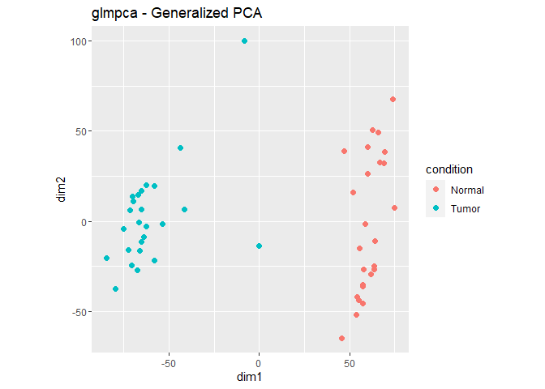
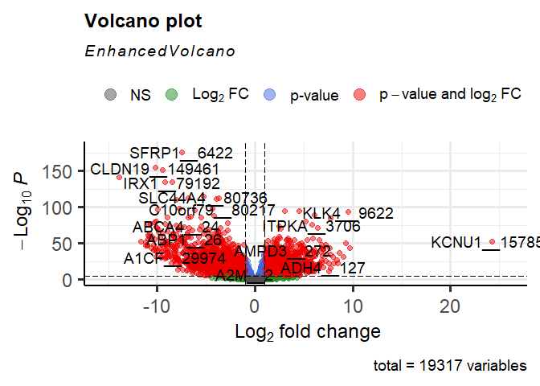

Expression analysis DESeq2
================
Oliver Hölsken
7 12 2021

## Load RDS

``` r
Expression_data <- readRDS("D:/Google Drive/8_MDS/KW3/Course_MDS/example_KICH.rda")
```

## Preparing the workspace

### Install Bioconductor

``` r
if(!requireNamespace("BiocManager", quietly = TRUE))
  install.packages("BiocManager")
BiocManager::install(version = "3.14")
```

    ## Bioconductor version 3.14 (BiocManager 1.30.16), R 4.1.2 (2021-11-01)

    ## Old packages: 'digest', 'pracma'

### Install required BioConductor packages

``` r
BiocManager::install(c('DESeq2', 'InteractiveComplexHeatmap', 'glmpca', 'EnhancedVolcano', 'ComplexHeatmap'))
```

    ## Bioconductor version 3.14 (BiocManager 1.30.16), R 4.1.2 (2021-11-01)

    ## Warning: package(s) not installed when version(s) same as current; use `force = TRUE` to
    ##   re-install: 'DESeq2' 'InteractiveComplexHeatmap' 'glmpca' 'EnhancedVolcano'
    ##   'ComplexHeatmap'

    ## Old packages: 'digest', 'pracma'

``` r
library(BiocManager)
library(DESeq2)
```

    ## Lade nötiges Paket: S4Vectors

    ## Lade nötiges Paket: stats4

    ## Lade nötiges Paket: BiocGenerics

    ## 
    ## Attache Paket: 'BiocGenerics'

    ## Die folgenden Objekte sind maskiert von 'package:stats':
    ## 
    ##     IQR, mad, sd, var, xtabs

    ## Die folgenden Objekte sind maskiert von 'package:base':
    ## 
    ##     anyDuplicated, append, as.data.frame, basename, cbind, colnames,
    ##     dirname, do.call, duplicated, eval, evalq, Filter, Find, get, grep,
    ##     grepl, intersect, is.unsorted, lapply, Map, mapply, match, mget,
    ##     order, paste, pmax, pmax.int, pmin, pmin.int, Position, rank,
    ##     rbind, Reduce, rownames, sapply, setdiff, sort, table, tapply,
    ##     union, unique, unsplit, which.max, which.min

    ## 
    ## Attache Paket: 'S4Vectors'

    ## Die folgenden Objekte sind maskiert von 'package:base':
    ## 
    ##     expand.grid, I, unname

    ## Lade nötiges Paket: IRanges

    ## 
    ## Attache Paket: 'IRanges'

    ## Das folgende Objekt ist maskiert 'package:grDevices':
    ## 
    ##     windows

    ## Lade nötiges Paket: GenomicRanges

    ## Lade nötiges Paket: GenomeInfoDb

    ## Lade nötiges Paket: SummarizedExperiment

    ## Lade nötiges Paket: MatrixGenerics

    ## Lade nötiges Paket: matrixStats

    ## 
    ## Attache Paket: 'MatrixGenerics'

    ## Die folgenden Objekte sind maskiert von 'package:matrixStats':
    ## 
    ##     colAlls, colAnyNAs, colAnys, colAvgsPerRowSet, colCollapse,
    ##     colCounts, colCummaxs, colCummins, colCumprods, colCumsums,
    ##     colDiffs, colIQRDiffs, colIQRs, colLogSumExps, colMadDiffs,
    ##     colMads, colMaxs, colMeans2, colMedians, colMins, colOrderStats,
    ##     colProds, colQuantiles, colRanges, colRanks, colSdDiffs, colSds,
    ##     colSums2, colTabulates, colVarDiffs, colVars, colWeightedMads,
    ##     colWeightedMeans, colWeightedMedians, colWeightedSds,
    ##     colWeightedVars, rowAlls, rowAnyNAs, rowAnys, rowAvgsPerColSet,
    ##     rowCollapse, rowCounts, rowCummaxs, rowCummins, rowCumprods,
    ##     rowCumsums, rowDiffs, rowIQRDiffs, rowIQRs, rowLogSumExps,
    ##     rowMadDiffs, rowMads, rowMaxs, rowMeans2, rowMedians, rowMins,
    ##     rowOrderStats, rowProds, rowQuantiles, rowRanges, rowRanks,
    ##     rowSdDiffs, rowSds, rowSums2, rowTabulates, rowVarDiffs, rowVars,
    ##     rowWeightedMads, rowWeightedMeans, rowWeightedMedians,
    ##     rowWeightedSds, rowWeightedVars

    ## Lade nötiges Paket: Biobase

    ## Welcome to Bioconductor
    ## 
    ##     Vignettes contain introductory material; view with
    ##     'browseVignettes()'. To cite Bioconductor, see
    ##     'citation("Biobase")', and for packages 'citation("pkgname")'.

    ## 
    ## Attache Paket: 'Biobase'

    ## Das folgende Objekt ist maskiert 'package:MatrixGenerics':
    ## 
    ##     rowMedians

    ## Die folgenden Objekte sind maskiert von 'package:matrixStats':
    ## 
    ##     anyMissing, rowMedians

``` r
library(glmpca)
library(EnhancedVolcano)
```

    ## Lade nötiges Paket: ggplot2

    ## Lade nötiges Paket: ggrepel

    ## Registered S3 methods overwritten by 'ggalt':
    ##   method                  from   
    ##   grid.draw.absoluteGrob  ggplot2
    ##   grobHeight.absoluteGrob ggplot2
    ##   grobWidth.absoluteGrob  ggplot2
    ##   grobX.absoluteGrob      ggplot2
    ##   grobY.absoluteGrob      ggplot2

``` r
library(ggplot2)
library(ggrepel)
library(genefilter)
```

    ## 
    ## Attache Paket: 'genefilter'

    ## Die folgenden Objekte sind maskiert von 'package:MatrixGenerics':
    ## 
    ##     rowSds, rowVars

    ## Die folgenden Objekte sind maskiert von 'package:matrixStats':
    ## 
    ##     rowSds, rowVars

``` r
library(openxlsx)
library(pheatmap)
library(openxlsx)
library(ComplexHeatmap)
```

    ## Lade nötiges Paket: grid

    ## ========================================
    ## ComplexHeatmap version 2.10.0
    ## Bioconductor page: http://bioconductor.org/packages/ComplexHeatmap/
    ## Github page: https://github.com/jokergoo/ComplexHeatmap
    ## Documentation: http://jokergoo.github.io/ComplexHeatmap-reference
    ## 
    ## If you use it in published research, please cite:
    ## Gu, Z. Complex heatmaps reveal patterns and correlations in multidimensional 
    ##   genomic data. Bioinformatics 2016.
    ## 
    ## The new InteractiveComplexHeatmap package can directly export static 
    ## complex heatmaps into an interactive Shiny app with zero effort. Have a try!
    ## 
    ## This message can be suppressed by:
    ##   suppressPackageStartupMessages(library(ComplexHeatmap))
    ## ========================================
    ## ! pheatmap() has been masked by ComplexHeatmap::pheatmap(). Most of the arguments
    ##    in the original pheatmap() are identically supported in the new function. You 
    ##    can still use the original function by explicitly calling pheatmap::pheatmap().

    ## 
    ## Attache Paket: 'ComplexHeatmap'

    ## Das folgende Objekt ist maskiert 'package:pheatmap':
    ## 
    ##     pheatmap

    ## Das folgende Objekt ist maskiert 'package:genefilter':
    ## 
    ##     dist2

## Perform Differential expression analysis

### Generate a DESeqData Set

``` r
countMat <- Expression_data$countMat
ann <- Expression_data$ann
condition <- ann$condition
geneMat <- Expression_data$geneMat
```

``` r
###### Excluding low/ none expressed genes
keep <- rowSums(countMat > 0) >= 3 

# BUILD DESEQ DATA
dds <- DESeqDataSetFromMatrix(countData = countMat[keep, ],
                              colData = ann,
                              design = ~ condition)
```

    ## converting counts to integer mode

    ## Warning in DESeqDataSet(se, design = design, ignoreRank): some variables in
    ## design formula are characters, converting to factors

``` r
mcols(dds) <- DataFrame(mcols(dds), geneMat[keep, ])
```

## PCA Analyse

Diese kan mit generalized principal cmponent analyse (GLM-PCA)
durchgeführt werden. Das Package heißt glmpca.

``` r
gpca <- glmpca(counts(dds), L=2)
gpca.dat <- gpca$factors
gpca.dat$condition <- dds$condition
```

``` r
ggplot(gpca.dat, aes(x = dim1, y = dim2, color = condition)) +
  geom_point(size =2) + coord_fixed() + ggtitle("glmpca - Generalized PCA")
```

<!-- -->
Die Proben des Normalgewebes (rot) unterscheiden sich voneinander auf
der y-Achse (dim2). Sie unterscheiden sich vom Tumorgewebe (blau) auf
der x-Achse (dim1). Eine Probe liegt in der Mitte zwischen beiden
Gruppen.

## Perform differential expression analysis

``` r
# GET COUNT
dds <- estimateSizeFactors(dds)
dds.counts <- counts(dds, normalized=TRUE)
```

``` r
# DIFFERENTIAL ANALYSIS
dds <- DESeq(dds, test = "Wald", fitType = "mean")
```

    ## using pre-existing size factors

    ## estimating dispersions

    ## gene-wise dispersion estimates

    ## mean-dispersion relationship

    ## final dispersion estimates

    ## fitting model and testing

    ## -- replacing outliers and refitting for 1034 genes
    ## -- DESeq argument 'minReplicatesForReplace' = 7 
    ## -- original counts are preserved in counts(dds)

    ## estimating dispersions

    ## fitting model and testing

``` r
result_dss = results(dds)
```

``` r
summary(result_dss)
```

    ## 
    ## out of 19317 with nonzero total read count
    ## adjusted p-value < 0.1
    ## LFC > 0 (up)       : 6597, 34%
    ## LFC < 0 (down)     : 6589, 34%
    ## outliers [1]       : 0, 0%
    ## low counts [2]     : 0, 0%
    ## (mean count < 0)
    ## [1] see 'cooksCutoff' argument of ?results
    ## [2] see 'independentFiltering' argument of ?results

``` r
library(openxlsx)
# get the output names of the result
result_dss$entrez_ID <- rownames(result_dss)
results.deseq2 <- as.data.frame(result_dss)
```

``` r
# Change column names
colnames(results.deseq2)
```

    ## [1] "baseMean"       "log2FoldChange" "lfcSE"          "stat"          
    ## [5] "pvalue"         "padj"           "entrez_ID"

``` r
# entrezID first column
results.deseq2 <- results.deseq2[, c(7,1,2,3,4,5,6)]
```

``` r
# Order by adjusted p value
results.deseq2.tmp <- results.deseq2[!is.na(results.deseq2$padj),]
results.deseq2.sig <- results.deseq2.tmp[results.deseq2.tmp$padj < 0.05,]
results.deseq2.sig.sort <- results.deseq2.sig[order(results.deseq2.sig$padj, decreasing = F),]
write.xlsx(results.deseq2.sig.sort, file = "KICH_NormalvsTumor_DESeq.xlsx", asTable = F, firstRow = T, headerStyle = createStyle(textDecoration = 'bold'), keepNA = F, rowNames = F, overwrite = T)
```

``` r
# Order by 2 FOLD change
results.deseq2.sig.up <-  results.deseq2.sig.sort[order(results.deseq2.sig.sort$log2FoldChange
, decreasing = T),]
```

``` r
#Upregulated Genes
results.deseq2.sig.up.2FC <- results.deseq2.sig.up[results.deseq2.sig.up$log2FoldChange > 2,]
#Downregulated Genes
results.deseq2.sig.down.2FC.tmp <- results.deseq2.sig.up[results.deseq2.sig.up$log2FoldChange < -2,]
results.deseq2.sig.down.2FC <- results.deseq2.sig.down.2FC.tmp[order(results.deseq2.sig.down.2FC.tmp$log2FoldChange, decreasing = F),]
```

``` r
#Write xlsx
write.xlsx(results.deseq2.sig.up.2FC, file = "KICH_NormalvsTumor_DESeq_up.xlsx", asTable = F, firstRow = T, headerStyle = createStyle(textDecoration = 'bold'), keepNA = F, rowNames = F, overwrite = T)
write.xlsx(results.deseq2.sig.down.2FC , file = "KICH_NormalvsTumor_DESeq_down.xlsx", asTable = F, firstRow = T, headerStyle = createStyle(textDecoration = 'bold'), keepNA = F, rowNames = F, overwrite = T)
```

## Volcano Plot

### Plot basic Volcano Plot

``` r
EnhancedVolcano(result_dss,
    lab = rownames(result_dss),
    x = 'log2FoldChange',
    y = 'pvalue')
```

<!-- -->

## Heatmap

``` r
BiocManager::install('ComplexHeatmap')
```

    ## Bioconductor version 3.14 (BiocManager 1.30.16), R 4.1.2 (2021-11-01)

    ## Warning: package(s) not installed when version(s) same as current; use `force = TRUE` to
    ##   re-install: 'ComplexHeatmap'

    ## Old packages: 'digest', 'pracma'

``` r
library(ComplexHeatmap)
```

Select 20 top upregulated and 20 top downregulated genes

``` r
top_up <- results.deseq2.sig.up.2FC[1:20, "entrez_ID"]
top_down <- results.deseq2.sig.down.2FC[1:20, "entrez_ID"]
```

### count normalized

``` r
library("pheatmap")
```

### rlog-transformed

``` r
# get normalized rlogs
rld <- rlogTransformation(dds, blind=TRUE)
```

    ## rlog() may take a long time with 50 or more samples,
    ## vst() is a much faster transformation

``` r
rlds <- assay(rld)
```

### rlog scaled

## Citations

``` r
citation("DESeq2")
```

    ## 
    ##   Love, M.I., Huber, W., Anders, S. Moderated estimation of fold change
    ##   and dispersion for RNA-seq data with DESeq2 Genome Biology 15(12):550
    ##   (2014)
    ## 
    ## Ein BibTeX-Eintrag für LaTeX-Benutzer ist
    ## 
    ##   @Article{,
    ##     title = {Moderated estimation of fold change and dispersion for RNA-seq data with DESeq2},
    ##     author = {Michael I. Love and Wolfgang Huber and Simon Anders},
    ##     year = {2014},
    ##     journal = {Genome Biology},
    ##     doi = {10.1186/s13059-014-0550-8},
    ##     volume = {15},
    ##     issue = {12},
    ##     pages = {550},
    ##   }

``` r
citation("InteractiveComplexHeatmap")
```

    ## 
    ## The methods within the code package can be cited as:
    ## 
    ##   Gu, Z. (2021) Make Interactive Complex Heatmaps in R. bioRxiv.
    ## 
    ## Ein BibTeX-Eintrag für LaTeX-Benutzer ist
    ## 
    ##   @Article{,
    ##     title = {Make Interactive Complex Heatmaps in R},
    ##     author = {Zuguang Gu and Daniel Huebschmann},
    ##     journal = {bioRxiv},
    ##     year = {2021},
    ##   }
    ## 
    ## This free open-source software implements academic research by the
    ## authors and co-workers. If you use it, please support the project by
    ## citing the appropriate journal articles.

``` r
citation("EnhancedVolcano")
```

    ## 
    ## To cite package 'EnhancedVolcano' in publications use:
    ## 
    ##   Kevin Blighe, Sharmila Rana and Myles Lewis (2021). EnhancedVolcano:
    ##   Publication-ready volcano plots with enhanced colouring and labeling.
    ##   R package version 1.12.0.
    ##   https://github.com/kevinblighe/EnhancedVolcano
    ## 
    ## Ein BibTeX-Eintrag für LaTeX-Benutzer ist
    ## 
    ##   @Manual{,
    ##     title = {EnhancedVolcano: Publication-ready volcano plots with enhanced colouring and
    ## labeling},
    ##     author = {Kevin Blighe and Sharmila Rana and Myles Lewis},
    ##     year = {2021},
    ##     note = {R package version 1.12.0},
    ##     url = {https://github.com/kevinblighe/EnhancedVolcano},
    ##   }

``` r
citation("ComplexHeatmap")
```

    ## 
    ## The methods within the code package can be cited as:
    ## 
    ##   Gu, Z. (2016) Complex heatmaps reveal patterns and correlations in
    ##   multidimensional genomic data. Bioinformatics.
    ## 
    ## Ein BibTeX-Eintrag für LaTeX-Benutzer ist
    ## 
    ##   @Article{,
    ##     title = {Complex heatmaps reveal patterns and correlations in multidimensional genomic data},
    ##     author = {Zuguang Gu and Roland Eils and Matthias Schlesner},
    ##     journal = {Bioinformatics},
    ##     year = {2016},
    ##   }
    ## 
    ## This free open-source software implements academic research by the
    ## authors and co-workers. If you use it, please support the project by
    ## citing the appropriate journal articles.

## Session info

``` r
sessionInfo()
```

    ## R version 4.1.2 (2021-11-01)
    ## Platform: x86_64-w64-mingw32/x64 (64-bit)
    ## Running under: Windows 10 x64 (build 19042)
    ## 
    ## Matrix products: default
    ## 
    ## locale:
    ## [1] LC_COLLATE=German_Germany.1252  LC_CTYPE=German_Germany.1252   
    ## [3] LC_MONETARY=German_Germany.1252 LC_NUMERIC=C                   
    ## [5] LC_TIME=German_Germany.1252    
    ## 
    ## attached base packages:
    ## [1] grid      stats4    stats     graphics  grDevices utils     datasets 
    ## [8] methods   base     
    ## 
    ## other attached packages:
    ##  [1] ComplexHeatmap_2.10.0       pheatmap_1.0.12            
    ##  [3] openxlsx_4.2.4              genefilter_1.76.0          
    ##  [5] EnhancedVolcano_1.12.0      ggrepel_0.9.1              
    ##  [7] ggplot2_3.3.5               glmpca_0.2.0               
    ##  [9] DESeq2_1.34.0               SummarizedExperiment_1.24.0
    ## [11] Biobase_2.54.0              MatrixGenerics_1.6.0       
    ## [13] matrixStats_0.61.0          GenomicRanges_1.46.1       
    ## [15] GenomeInfoDb_1.30.0         IRanges_2.28.0             
    ## [17] S4Vectors_0.32.3            BiocGenerics_0.40.0        
    ## [19] BiocManager_1.30.16        
    ## 
    ## loaded via a namespace (and not attached):
    ##  [1] ggbeeswarm_0.6.0       colorspace_2.0-2       rjson_0.2.20          
    ##  [4] ellipsis_0.3.2         circlize_0.4.13        XVector_0.34.0        
    ##  [7] GlobalOptions_0.1.2    clue_0.3-60            farver_2.1.0          
    ## [10] bit64_4.0.5            AnnotationDbi_1.56.2   fansi_0.5.0           
    ## [13] codetools_0.2-18       splines_4.1.2          extrafont_0.17        
    ## [16] doParallel_1.0.16      cachem_1.0.6           geneplotter_1.72.0    
    ## [19] knitr_1.36             Rttf2pt1_1.3.9         annotate_1.72.0       
    ## [22] cluster_2.1.2          png_0.1-7              compiler_4.1.2        
    ## [25] httr_1.4.2             assertthat_0.2.1       Matrix_1.3-4          
    ## [28] fastmap_1.1.0          htmltools_0.5.2        tools_4.1.2           
    ## [31] gtable_0.3.0           glue_1.5.1             GenomeInfoDbData_1.2.7
    ## [34] dplyr_1.0.7            maps_3.4.0             Rcpp_1.0.7            
    ## [37] vctrs_0.3.8            Biostrings_2.62.0      ggalt_0.4.0           
    ## [40] extrafontdb_1.0        iterators_1.0.13       xfun_0.28             
    ## [43] stringr_1.4.0          lifecycle_1.0.1        XML_3.99-0.8          
    ## [46] zlibbioc_1.40.0        MASS_7.3-54            scales_1.1.1          
    ## [49] parallel_4.1.2         proj4_1.0-10.1         RColorBrewer_1.1-2    
    ## [52] yaml_2.2.1             memoise_2.0.1          ggrastr_1.0.0         
    ## [55] stringi_1.7.6          RSQLite_2.2.9          highr_0.9             
    ## [58] foreach_1.5.1          zip_2.2.0              BiocParallel_1.28.2   
    ## [61] shape_1.4.6            rlang_0.4.12           pkgconfig_2.0.3       
    ## [64] bitops_1.0-7           evaluate_0.14          lattice_0.20-45       
    ## [67] purrr_0.3.4            labeling_0.4.2         bit_4.0.4             
    ## [70] tidyselect_1.1.1       magrittr_2.0.1         R6_2.5.1              
    ## [73] generics_0.1.1         DelayedArray_0.20.0    DBI_1.1.1             
    ## [76] pillar_1.6.4           withr_2.4.3            survival_3.2-13       
    ## [79] KEGGREST_1.34.0        RCurl_1.98-1.5         ash_1.0-15            
    ## [82] tibble_3.1.6           crayon_1.4.2           KernSmooth_2.23-20    
    ## [85] utf8_1.2.2             rmarkdown_2.11         GetoptLong_1.0.5      
    ## [88] locfit_1.5-9.4         blob_1.2.2             digest_0.6.28         
    ## [91] xtable_1.8-4           munsell_0.5.0          beeswarm_0.4.0        
    ## [94] vipor_0.4.5
