RNA-Sequencing Analysis using DESeq2
================
Oliver Hölsken
11.12.2021

## Load RDS

``` r
Expression_data <- 
  readRDS("D:/Google Drive/8_MDS/KW3/Course_MDS/example_KICH.rda")
```

## Preparing the workspace

### Install Bioconductor

``` r
if(!requireNamespace("BiocManager", quietly = TRUE))
  install.packages("BiocManager")
BiocManager::install(version = "3.14")
```

### Install required BioConductor packages

``` r
BiocManager::install(c('DESeq2', 'glmpca', 'EnhancedVolcano'))
```

    ## Warning: package(s) not installed when version(s) same as current; use `force = TRUE` to
    ##   re-install: 'DESeq2' 'glmpca' 'EnhancedVolcano'

``` r
library(BiocManager)
library(ggplot2)
library(ggrepel)
library(genefilter)
library(dplyr)
library(tibble)
library(readr)
library(FactoMineR)
library(tidyr)
library(tidyverse)
library(DESeq2)
```

## Perform Differential expression analysis

### Generate a DESeq2 Data Set

``` r
countMat <- Expression_data$countMat
ann <- Expression_data$ann
condition <- ann$condition
geneMat <- Expression_data$geneMat
```

``` r
library(DESeq2)
```

``` r
# Excluding low/ none expressed genes
keep <- rowSums(countMat > 0) >= 3 

# BUILD DESEQ DATA
dds <- DESeqDataSetFromMatrix(countData = countMat[keep, ],
                              colData = ann,
                              design = ~ condition)
```

    ## converting counts to integer mode

    ## Warning in DESeqDataSet(se, design = design, ignoreRank): some variables in
    ## design formula are characters, converting to factors

``` r
mcols(dds) <- DataFrame(mcols(dds), geneMat[keep, ])
```

``` r
# GET COUNT
dds <- estimateSizeFactors(dds)
dds.counts <- counts(dds, normalized=TRUE)
```

``` r
# get normalized rlogs
rld <- rlogTransformation(dds, blind=TRUE)
```

    ## rlog() may take a long time with 50 or more samples,
    ## vst() is a much faster transformation

``` r
rlds <- assay(rld)
```

## PCA Analyse

Dies dient der Visualisierung von Sample-Sample Abständen. Die
Datenpunkte werden in einer 2D Projektion geplottet. Diese Richtungen
können die Unterschiede der Proben erklären.

### GLM-PCA

Steht für generalized PCA. Das Package heißt glmpca (Twones et
al. 2019). Als Input werden die counts verwendet. Es vermeidet die
Probleme, die bei der Normalisierng auftreten können.

``` r
library(glmpca)
```

``` r
gpca <- glmpca(counts(dds), L=2)
gpca.dat <- gpca$factors
gpca.dat$condition <- dds$condition
```

``` r
p <- ggplot(gpca.dat, aes(x = dim1, y = dim2, color = condition)) +
  geom_point(size=3) +
  xlab("PC1") +
  ylab("PC2") +
  coord_fixed() +
  ggtitle("Principal Component Analysis", subtitle = "read counts [glmpca]")

p + theme(plot.title=element_text(color="black", size=14, face="bold"))
```

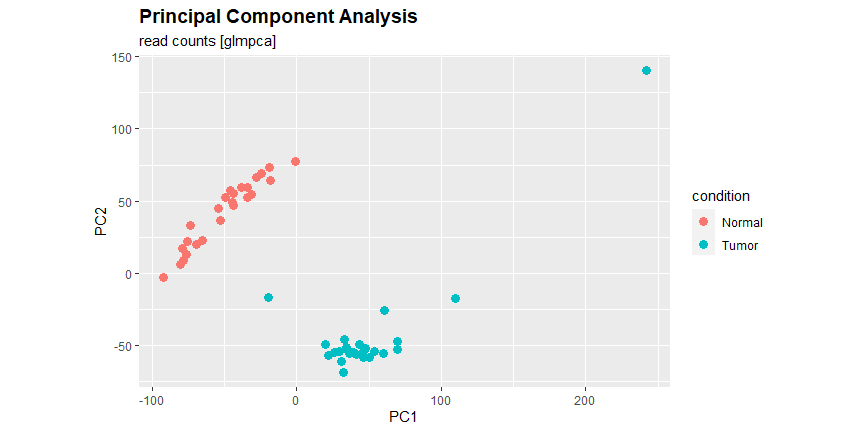<!-- -->

``` r
#Save as PDF
ggsave(
  file = "PCA_readcounts.pdf",
  plot = last_plot(),
  path = NULL,
  scale = 1,
  width = 11.69,
  height = 8.27,
  units = "in",
  dpi = "retina",
  limitsize = TRUE,
  bg = NULL,
)
```

Die Proben des Normalgewebes (rot) unterscheiden sich voneinander auf
der y-Achse (dim2). Sie unterscheiden sich vom Tumorgewebe (blau) auf
der x-Achse (dim1). Eine Probe liegt in der Mitte zwischen beiden
Gruppen, es gibt einen outlier bei den Tumor-Samples in dim2.

Die rlog-transformierten Daten können ebenfalls verwendet werden mittels
der `plotPCA` Funktion des `DESeq2` Package:

``` r
pcaData <- plotPCA(rld, intgroup=c("condition"), returnData=TRUE)
percentVar <- round(100 * attr(pcaData, "percentVar"))
```

``` r
p <- ggplot(pcaData, aes(PC1, PC2, color=condition)) +
  geom_point(size=3) +
  xlab(paste0("PC1: ",percentVar[1],"% variance")) +
  ylab(paste0("PC2: ",percentVar[2],"% variance")) + 
  coord_fixed() +
  ggtitle("Principal Component Analysis", subtitle = "rlog-transformed [DESeq2]")

p + theme(plot.title=element_text(color="black", size=14, face="bold"))
```

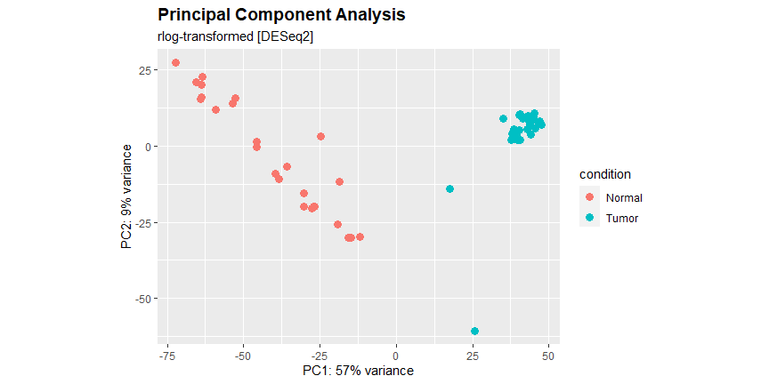<!-- -->

``` r
# Save as PDF
ggsave(
  file = "PCA_rlog.pdf",
  plot = last_plot(),
  path = NULL,
  scale = 1,
  width = 11.69,
  height = 8.27,
  units = "in",
  dpi = "retina",
  limitsize = TRUE,
  bg = NULL,
)
```

## Perform differential expression analysis

``` r
# DIFFERENTIAL ANALYSIS
dds <- DESeq(dds, test = "Wald", fitType = "mean")
result_dss = results(dds)
```

``` r
summary(result_dss)
```

    ## 
    ## out of 19317 with nonzero total read count
    ## adjusted p-value < 0.1
    ## LFC > 0 (up)       : 6597, 34%
    ## LFC < 0 (down)     : 6589, 34%
    ## outliers [1]       : 0, 0%
    ## low counts [2]     : 0, 0%
    ## (mean count < 0)
    ## [1] see 'cooksCutoff' argument of ?results
    ## [2] see 'independentFiltering' argument of ?results

### Data Frame transformations

``` r
#Transform results to Data-Frame
results.deseq2 <- as.data.frame(result_dss)
```

``` r
# Apply new column "Gene" from row Names
results.deseq2$Gene <- row.names(results.deseq2)
head(results.deseq2)
```

    ##                  baseMean log2FoldChange     lfcSE        stat       pvalue
    ## A1BG__1          44.53785     -0.7247072 0.3075293  -2.3565468 1.844575e-02
    ## A1CF__29974      43.10693     -8.1031350 0.6962427 -11.6383765 2.629736e-31
    ## A2BP1__54715     13.69221     -0.4792066 0.5697270  -0.8411162 4.002829e-01
    ## A2LD1__87769    549.07174     -3.9213580 0.3595323 -10.9068301 1.069198e-27
    ## A2ML1__144568     1.08798      1.8018951 0.6735547   2.6752025 7.468413e-03
    ## A2M__2        14525.75971     -1.0568956 0.1866217  -5.6633060 1.484840e-08
    ##                       padj          Gene
    ## A1BG__1       3.038946e-02       A1BG__1
    ## A1CF__29974   8.912037e-30   A1CF__29974
    ## A2BP1__54715  4.817910e-01  A2BP1__54715
    ## A2LD1__87769  2.817695e-26  A2LD1__87769
    ## A2ML1__144568 1.325134e-02 A2ML1__144568
    ## A2M__2        5.945824e-08        A2M__2

``` r
#Split both Values in the Gene column to "Gene_Name" and "Entrez_ID".
results.deseq2 <- separate(results.deseq2, 
                           Gene, 
                           sep = "__", 
                           into = c("Gene_Name", "Entrez_ID"))
head(results.deseq2)
```

    ##                  baseMean log2FoldChange     lfcSE        stat       pvalue
    ## A1BG__1          44.53785     -0.7247072 0.3075293  -2.3565468 1.844575e-02
    ## A1CF__29974      43.10693     -8.1031350 0.6962427 -11.6383765 2.629736e-31
    ## A2BP1__54715     13.69221     -0.4792066 0.5697270  -0.8411162 4.002829e-01
    ## A2LD1__87769    549.07174     -3.9213580 0.3595323 -10.9068301 1.069198e-27
    ## A2ML1__144568     1.08798      1.8018951 0.6735547   2.6752025 7.468413e-03
    ## A2M__2        14525.75971     -1.0568956 0.1866217  -5.6633060 1.484840e-08
    ##                       padj Gene_Name Entrez_ID
    ## A1BG__1       3.038946e-02      A1BG         1
    ## A1CF__29974   8.912037e-30      A1CF     29974
    ## A2BP1__54715  4.817910e-01     A2BP1     54715
    ## A2LD1__87769  2.817695e-26     A2LD1     87769
    ## A2ML1__144568 1.325134e-02     A2ML1    144568
    ## A2M__2        5.945824e-08       A2M         2

``` r
# set Gene_Name to first column
results.deseq2 <- results.deseq2[, c(7,8,1,2,3,4,5,6)]
head(results.deseq2)
```

    ##               Gene_Name Entrez_ID    baseMean log2FoldChange     lfcSE
    ## A1BG__1            A1BG         1    44.53785     -0.7247072 0.3075293
    ## A1CF__29974        A1CF     29974    43.10693     -8.1031350 0.6962427
    ## A2BP1__54715      A2BP1     54715    13.69221     -0.4792066 0.5697270
    ## A2LD1__87769      A2LD1     87769   549.07174     -3.9213580 0.3595323
    ## A2ML1__144568     A2ML1    144568     1.08798      1.8018951 0.6735547
    ## A2M__2              A2M         2 14525.75971     -1.0568956 0.1866217
    ##                      stat       pvalue         padj
    ## A1BG__1        -2.3565468 1.844575e-02 3.038946e-02
    ## A1CF__29974   -11.6383765 2.629736e-31 8.912037e-30
    ## A2BP1__54715   -0.8411162 4.002829e-01 4.817910e-01
    ## A2LD1__87769  -10.9068301 1.069198e-27 2.817695e-26
    ## A2ML1__144568   2.6752025 7.468413e-03 1.325134e-02
    ## A2M__2         -5.6633060 1.484840e-08 5.945824e-08

``` r
# Order results by adjusted p value
results.deseq2.tmp <- results.deseq2[!is.na(results.deseq2$padj),]
results.deseq2.sig <- results.deseq2.tmp[which(results.deseq2.tmp$padj < 0.1),]
results.deseq2.sig.sort <- results.deseq2.sig[order(results.deseq2.sig$padj, 
                                                    decreasing = F),]
head(results.deseq2.sig.sort)
```

    ##                Gene_Name Entrez_ID    baseMean log2FoldChange     lfcSE
    ## SFRP1__6422        SFRP1      6422   4259.7265      -7.504766 0.2645551
    ## CLDN19__149461    CLDN19    149461   1481.8347     -10.162496 0.3829832
    ## SLC9A3__6550      SLC9A3      6550   2226.0493      -9.419582 0.3586448
    ## UMOD__7369          UMOD      7369 114245.9944     -13.892978 0.5477335
    ## IRX1__79192         IRX1     79192    350.6543      -8.450470 0.3413448
    ## UGT3A1__133688    UGT3A1    133688    756.7011      -9.217647 0.3725829
    ##                     stat        pvalue          padj
    ## SFRP1__6422    -28.36750 5.092903e-177 9.837961e-173
    ## CLDN19__149461 -26.53509 3.816735e-155 3.686393e-151
    ## SLC9A3__6550   -26.26438 4.897083e-152 3.153232e-148
    ## UMOD__7369     -25.36448 6.220637e-142 3.004101e-138
    ## IRX1__79192    -24.75640 2.645200e-135 1.021947e-131
    ## UGT3A1__133688 -24.73985 3.986900e-135 1.283582e-131

Generate a `.xlsx` file for all DEG

``` r
library(openxlsx)
```

``` r
#Write xlsx file
write.xlsx(results.deseq2.sig.sort, 
           file = "KICH_NormalvsTumor_DESeq.xlsx", 
           asTable = F, 
           firstRow = T, 
           headerStyle = createStyle(textDecoration = 'bold'), 
           keepNA = F, 
           rowNames = F, 
           overwrite = T)
```

Determine which genes are up- and down-regulated (log2FC &gt; 0 or &lt;
0, respectively)

``` r
#Upregulated Genes (log2 FC > 0)
results.deseq2.up <- filter(results.deseq2.sig.sort, log2FoldChange >0) 
head(results.deseq2.up)
```

    ##              Gene_Name Entrez_ID  baseMean log2FoldChange     lfcSE     stat
    ## PHKA1__5255      PHKA1      5255  954.4815       3.002285 0.1444968 20.77752
    ## HAGHL__84264     HAGHL     84264 1209.9234       4.473427 0.2154308 20.76503
    ## KLK4__9622        KLK4      9622 1784.2420       9.562335 0.4644682 20.58771
    ## HCN2__610         HCN2       610 1552.6240       6.099920 0.3026359 20.15597
    ## KLK15__55554     KLK15     55554  504.6397       7.751174 0.3953849 19.60412
    ## SYNGR3__9143    SYNGR3      9143  891.9353       5.181701 0.2711818 19.10785
    ##                    pvalue         padj
    ## PHKA1__5255  6.914137e-96 8.347524e-93
    ## HAGHL__84264 8.967030e-96 1.018918e-92
    ## KLK4__9622   3.537152e-94 3.795953e-91
    ## HCN2__610    2.385464e-90 2.425263e-87
    ## KLK15__55554 1.425904e-85 1.101767e-82
    ## SYNGR3__9143 2.172297e-81 1.613933e-78

``` r
#Downregulated genes (log2 FC > 0)
results.deseq2.down <- filter(results.deseq2.sig.sort, log2FoldChange <0) 
head(results.deseq2.down)
```

    ##                Gene_Name Entrez_ID    baseMean log2FoldChange     lfcSE
    ## SFRP1__6422        SFRP1      6422   4259.7265      -7.504766 0.2645551
    ## CLDN19__149461    CLDN19    149461   1481.8347     -10.162496 0.3829832
    ## SLC9A3__6550      SLC9A3      6550   2226.0493      -9.419582 0.3586448
    ## UMOD__7369          UMOD      7369 114245.9944     -13.892978 0.5477335
    ## IRX1__79192         IRX1     79192    350.6543      -8.450470 0.3413448
    ## UGT3A1__133688    UGT3A1    133688    756.7011      -9.217647 0.3725829
    ##                     stat        pvalue          padj
    ## SFRP1__6422    -28.36750 5.092903e-177 9.837961e-173
    ## CLDN19__149461 -26.53509 3.816735e-155 3.686393e-151
    ## SLC9A3__6550   -26.26438 4.897083e-152 3.153232e-148
    ## UMOD__7369     -25.36448 6.220637e-142 3.004101e-138
    ## IRX1__79192    -24.75640 2.645200e-135 1.021947e-131
    ## UGT3A1__133688 -24.73985 3.986900e-135 1.283582e-131

Export results

``` r
#Write xlsx of DEG up- and downregulated (with two sheets)
list_of_datasets <- list("upregulated" = results.deseq2.up, 
                         "downregulated" = results.deseq2.down)

write.xlsx(list_of_datasets, 
           file = "KICH_NormalvsTumor_DESeq_up_down.v2.xlsx", 
           asTable = F, 
           firstRow = T, 
           headerStyle = createStyle(textDecoration = 'bold'), 
           keepNA = F, 
           rowNames = F, 
           overwrite = T)
```

## Volcano Plot

### Plot basic Volcano

This was done using the `EnhancedVolcano` Package.

``` r
library(EnhancedVolcano)
```

    ## Registered S3 methods overwritten by 'ggalt':
    ##   method                  from   
    ##   grid.draw.absoluteGrob  ggplot2
    ##   grobHeight.absoluteGrob ggplot2
    ##   grobWidth.absoluteGrob  ggplot2
    ##   grobX.absoluteGrob      ggplot2
    ##   grobY.absoluteGrob      ggplot2

``` r
p <- EnhancedVolcano(results.deseq2,
    lab = results.deseq2$Gene_Name,
    title = 'Normal vs. Tumor DESeq2 results',
    subtitle = "Differential expression",
    pointSize = 2.0,
    labSize = 3.0,
    FCcutoff = 2.0,
    drawConnectors = TRUE,
    widthConnectors = 0.5,
    colConnectors = 'black', 
    boxedLabels = TRUE,
    pCutoff = 10e-32,
    labFace = 'bold',
    caption = bquote(~Log[2]~ "fold change cutoff, 2; p-value cutoff, 10e-32"),
    legendPosition = "right",
    legendLabSize = 10,
    x = 'log2FoldChange',
    y = 'pvalue') #+ coord_flip()
p
```

    ## Warning: ggrepel: 451 unlabeled data points (too many overlaps). Consider
    ## increasing max.overlaps

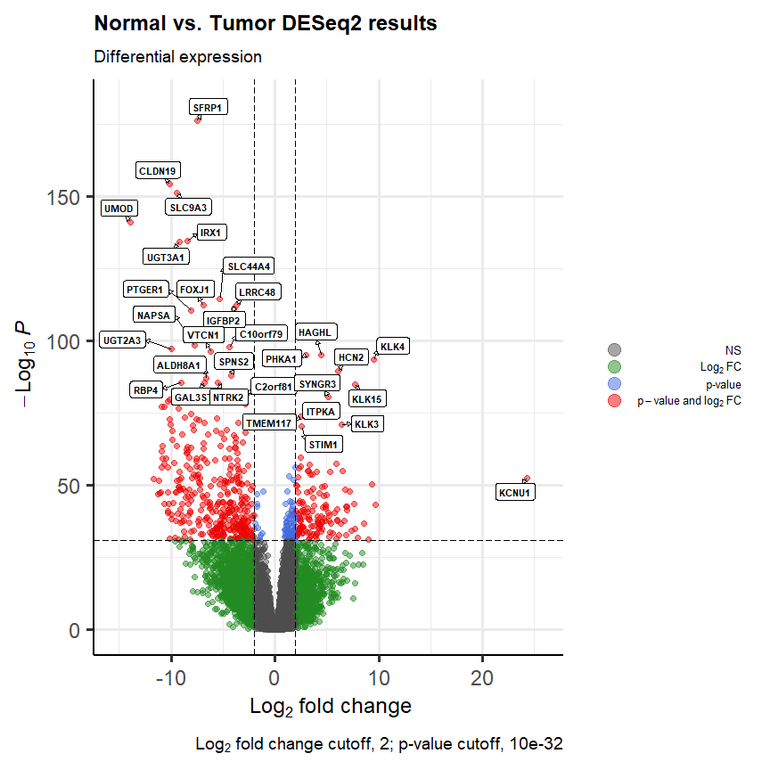<!-- -->

``` r
#Save as PDF
ggsave(
  file = "Volcanoplot.pdf",
  plot = last_plot(),
  path = NULL,
  scale = 1,
  width = 11.69,
  height = 8.27,
  units = "in",
  dpi = "retina",
  limitsize = TRUE,
  bg = NULL,
)
```

Ergebnis: KCNU1 is highly upregulated in the Tumor samples.

## Heatmaps

### Create a list with top 20 up-and downregulated genes

``` r
#Create date frame with significant genes (40)
total_up_down <- rbind(results.deseq2.up[1:20,],results.deseq2.down[1:20,])
#Add Gene column (used later to merge with count matrix)
total_up_down$Gene <- row.names(total_up_down)
total_up_down <- total_up_down %>% relocate(Gene, .before = Gene_Name)
head(total_up_down)
```

    ##                      Gene Gene_Name Entrez_ID  baseMean log2FoldChange
    ## PHKA1__5255   PHKA1__5255     PHKA1      5255  954.4815       3.002285
    ## HAGHL__84264 HAGHL__84264     HAGHL     84264 1209.9234       4.473427
    ## KLK4__9622     KLK4__9622      KLK4      9622 1784.2420       9.562335
    ## HCN2__610       HCN2__610      HCN2       610 1552.6240       6.099920
    ## KLK15__55554 KLK15__55554     KLK15     55554  504.6397       7.751174
    ## SYNGR3__9143 SYNGR3__9143    SYNGR3      9143  891.9353       5.181701
    ##                  lfcSE     stat       pvalue         padj
    ## PHKA1__5255  0.1444968 20.77752 6.914137e-96 8.347524e-93
    ## HAGHL__84264 0.2154308 20.76503 8.967030e-96 1.018918e-92
    ## KLK4__9622   0.4644682 20.58771 3.537152e-94 3.795953e-91
    ## HCN2__610    0.3026359 20.15597 2.385464e-90 2.425263e-87
    ## KLK15__55554 0.3953849 19.60412 1.425904e-85 1.101767e-82
    ## SYNGR3__9143 0.2711818 19.10785 2.172297e-81 1.613933e-78

### Normalized count matrix

``` r
# Transform count matrix to Data frame
heatmap_norm.df <- as.data.frame(dds.counts)
# Change Colum Labels
names(heatmap_norm.df) <- ann$condition
# Generate unique columnames
colnames(heatmap_norm.df) <- make.unique(names(heatmap_norm.df))
# add rownames as column
heatmap_norm.df$Gene <- row.names(heatmap_norm.df)
heatmap_norm.df <- heatmap_norm.df %>% relocate(Gene, .before = Normal)
```

#### Merge

``` r
# Merge total data frame and heatmap_norm.df by Gene column
data_frame_merge <- semi_join(heatmap_norm.df, total_up_down, 
                          by = 'Gene', all = F)
```

``` r
# Only add the Gene Name as Rowname, delete the Entrez ID for better overview
df <- separate(data_frame_merge, 
               Gene, 
               sep="__", 
               into = c("Gene_Name", "Entrez_ID"))
data_frame <- df %>% remove_rownames %>% column_to_rownames(var="Gene_Name")
data_frame_noID <- select(data_frame, select = -c(Entrez_ID))
```

#### Visualization

``` r
#Load pheatmap 
library(pheatmap)
```

``` r
#Convert to Matrix
data_frame_merge <- as.matrix(data_frame_noID)
```

``` r
#Plot
data_frame_merge %>% pheatmap(cluster_cols = F)
```

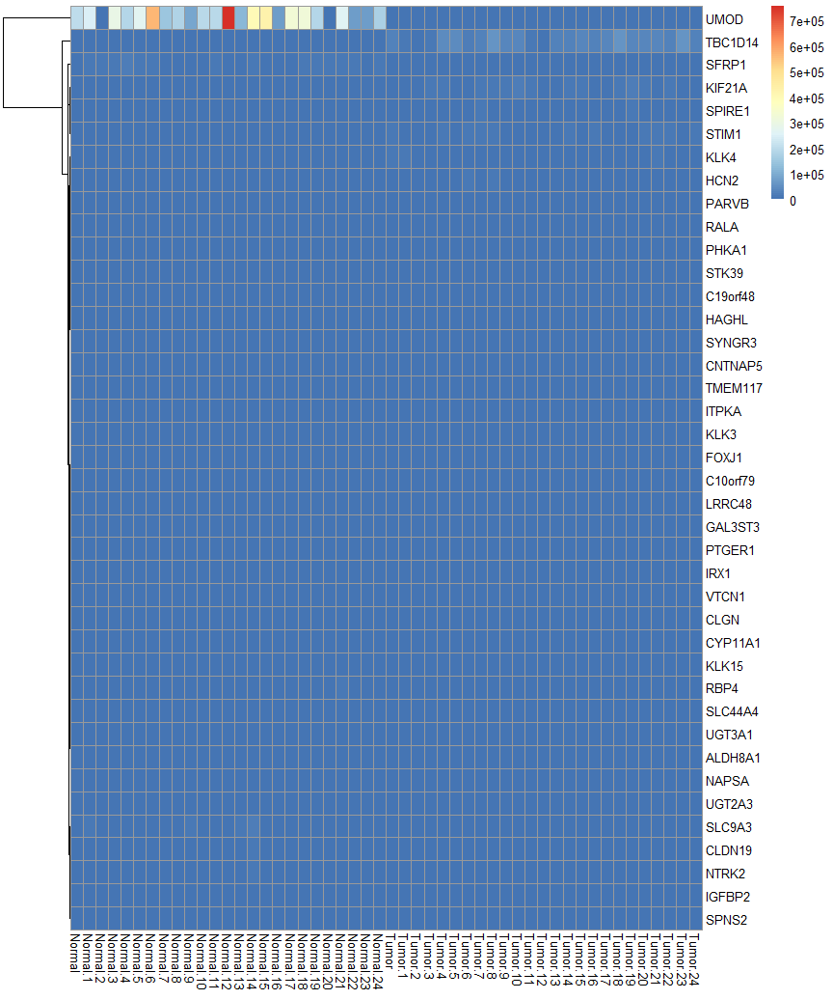

##### Log2 transformed

``` r
## Log2 tranformation
heatmap_data_log2 <- data_frame_merge %>% log2()
# Check if there are any INF values adn remove them
heatmap_data_log2[is.infinite(heatmap_data_log2)] <- 0
```

``` r
#Plot log2 heatmap
heatmap_data_log2 %>% pheatmap(cluster_cols = F)
```

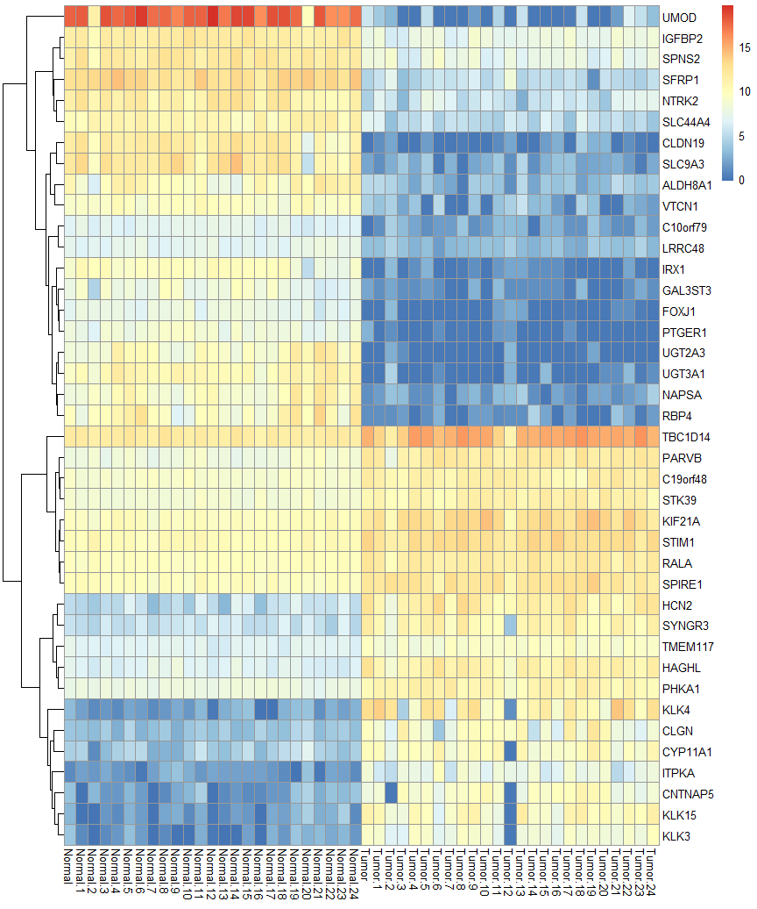

##### Substract Mean

``` r
## Substract the mean
heatmap_data_meanSubstract <- heatmap_data_log2 - rowMeans((heatmap_data_log2))
```

``` r
#Plot  heatmap
heatmap_data_meanSubstract %>% pheatmap(cluster_cols = F)
```

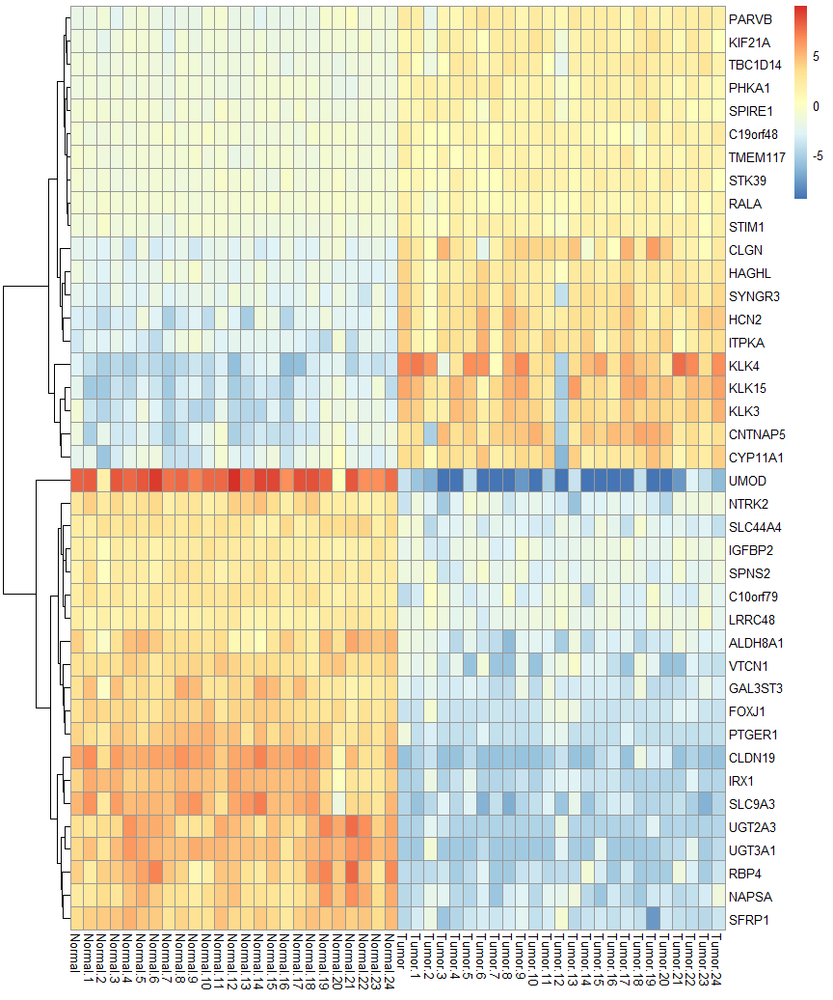

##### zScores (see also rlog transformed scaled)

``` r
heatmap_data_zscores <- heatmap_data_meanSubstract/
  rowSds(as.matrix(heatmap_data_log2))
```

``` r
heatmap_data_zscores %>%
  pheatmap(cluster_cols = F)
```

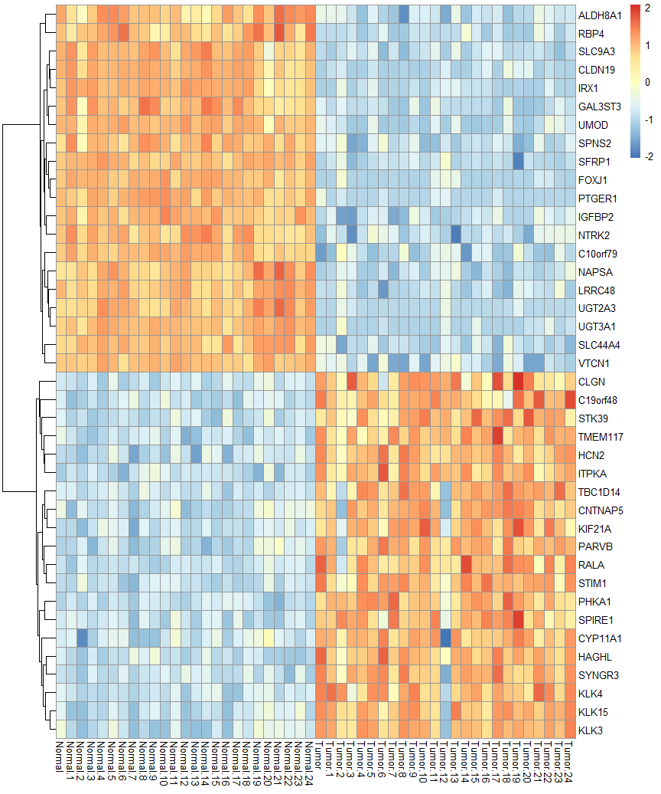

### rlog transformed count matrix

Die rlog Transformation ist eine Art der Count data transformation.
Ähnlich wie bei der `log2()` Funktion, werden die count Values
transformiert, aber es werden keine negativen Werte ausgegeben und die
Werte werden zur library size normalisiert.

> regularized logarithm or rlog, which incorporates a prior on the
> sample differences (Love, Huber, and Anders 2014). \[…\] produce
> transformed data on the log2 scale which has been normalized with
> respect to library size or other normalization factors.

Quelle:
<https://bioconductor.org/packages/release/bioc/vignettes/DESeq2/inst/doc/DESeq2.html#data-transformations-and-visualization>

``` r
# Transform to count matrix to Data frame
heatmap_rlog.df <- as.data.frame(rlds)
# Change Colum Labels
names(heatmap_rlog.df) <- ann$condition
colnames(heatmap_rlog.df) <- make.unique(names(heatmap_rlog.df))
# add rownames as column
heatmap_rlog.df$Gene <- row.names(heatmap_rlog.df)
heatmap_rlog.df <- heatmap_rlog.df %>% relocate(Gene, .before = Normal)
```

``` r
# Merge total data frame and heatmap_norm.df
data_frame_merge_rlog <- semi_join(heatmap_rlog.df, total_up_down, 
                          by = 'Gene', all = F)
```

``` r
# Only add the Gene Name as Rowname, delete the Entrez ID for better overview
df <- separate(data_frame_merge_rlog, Gene, sep="__", into = c("Gene_Name", "Entrez_ID"))
head(df)
```

    ##                 Gene_Name Entrez_ID    Normal  Normal.1 Normal.2  Normal.3
    ## ALDH8A1__64577    ALDH8A1     64577  9.752661  8.208823 6.507364  8.895953
    ## C10orf79__80217  C10orf79     80217  6.007223  6.641022 5.757752  6.411329
    ## C19orf48__84798  C19orf48     84798  9.358023  8.855714 9.018381  9.247383
    ## CLDN19__149461     CLDN19    149461 10.652528 11.509810 8.958369 10.966079
    ## CLGN__1047           CLGN      1047  4.676399  4.569906 4.328707  4.826275
    ## CNTNAP5__129684   CNTNAP5    129684  4.309157  3.092744 3.975347  3.440519
    ##                  Normal.4  Normal.5  Normal.6  Normal.7  Normal.8  Normal.9
    ## ALDH8A1__64577  10.270395 10.490029  9.952188  8.974107  9.106849  9.154446
    ## C10orf79__80217  5.965141  5.847496  6.320047  6.257995  6.155887  6.543669
    ## C19orf48__84798  8.990570  9.258425  9.393197  9.593853  9.134907  9.316440
    ## CLDN19__149461  10.278012 10.530884 10.825129 10.672763 11.274600 10.749760
    ## CLGN__1047       4.124855  5.165932  4.154012  4.439149  4.716197  4.127614
    ## CNTNAP5__129684  3.457792  3.958423  3.484784  3.049073  3.308199  3.726265
    ##                 Normal.10 Normal.11 Normal.12 Normal.13 Normal.14 Normal.15
    ## ALDH8A1__64577   8.680069  9.300949  7.370703  7.616380  6.939930  8.596996
    ## C10orf79__80217  6.531131  6.326355  6.748434  6.515012  6.477849  6.546010
    ## C19orf48__84798  9.620044  9.184668  9.319852  8.953425  9.094395  8.974515
    ## CLDN19__149461  10.671679  9.577835 10.629324 10.843053 11.820812 10.648420
    ## CLGN__1047       4.613591  4.895635  4.465419  4.920513  4.224638  4.372640
    ## CNTNAP5__129684  4.000917  4.802432  3.109792  3.252585  3.465252  3.290189
    ##                 Normal.16 Normal.17 Normal.18 Normal.19 Normal.20 Normal.21
    ## ALDH8A1__64577   9.964163  9.000651  8.235884 10.356455  9.050292 11.071890
    ## C10orf79__80217  5.793326  6.379835  6.631040  5.723556  5.492353  6.048074
    ## C19orf48__84798  9.167426  8.867962  9.477509  9.350767  9.467134  9.386225
    ## CLDN19__149461  10.561049 11.176320 10.977627  9.816673  7.044606  9.978456
    ## CLGN__1047       5.040717  4.490351  4.450913  5.179722  5.450670  4.364874
    ## CNTNAP5__129684  3.254482  3.436069  3.458751  4.399250  4.844766  3.786258
    ##                 Normal.22 Normal.23 Normal.24     Tumor   Tumor.1   Tumor.2
    ## ALDH8A1__64577  10.443636 10.072136 10.478383  5.600884  5.518917  5.379627
    ## C10orf79__80217  5.746958  5.880867  5.853096  2.684253  2.877114  4.441801
    ## C19orf48__84798  9.060902  9.252636  9.121205 11.327029 10.831365 10.256760
    ## CLDN19__149461   8.581188  8.687754 10.154709  3.953725  4.226058  4.464997
    ## CLGN__1047       4.796753  4.860316  4.467864  8.866879  7.991721  6.345738
    ## CNTNAP5__129684  4.308638  4.121210  4.413901  7.261177  7.798898  2.888534
    ##                   Tumor.3   Tumor.4   Tumor.5   Tumor.6   Tumor.7   Tumor.8
    ## ALDH8A1__64577   4.874810  4.312124  5.153138  4.533395  4.357254  3.998048
    ## C10orf79__80217  3.717582  3.231375  2.878887  3.107987  3.126400  4.080819
    ## C19orf48__84798 10.169397 10.810658 11.035952 10.588345 10.314998 11.035775
    ## CLDN19__149461   4.108817  4.099665  4.344234  3.957247  3.965631  4.159181
    ## CLGN__1047      10.090916  8.369333  7.748462  4.602765  7.175427  8.871720
    ## CNTNAP5__129684  8.993410  7.700056  8.398900  6.747977  8.228159  8.455210
    ##                   Tumor.9  Tumor.10  Tumor.11  Tumor.12  Tumor.13  Tumor.14
    ## ALDH8A1__64577   5.106601  5.074073  4.881604  4.112023  5.571224  4.319967
    ## C10orf79__80217  2.877876  3.074698  3.661028  3.756344  3.632126  2.670580
    ## C19orf48__84798 10.979823 11.035654 11.282605 10.922901 10.965356 10.759264
    ## CLDN19__149461   3.936724  4.100250  4.213983  4.495662  4.115648  3.945928
    ## CLGN__1047       9.186208  9.025176  8.868916  8.570742  9.583484  5.595782
    ## CNTNAP5__129684  8.694670  9.296475  8.230658  2.911772  6.917589  8.711363
    ##                  Tumor.15  Tumor.16  Tumor.17 Tumor.18  Tumor.19  Tumor.20
    ## ALDH8A1__64577   5.024306  4.815860  5.069170 4.271532  4.625382  4.659988
    ## C10orf79__80217  3.491313  3.512009  2.966366 2.967965  4.078723  3.232499
    ## C19orf48__84798 10.589100 10.129957 10.145897 9.532940 11.445685 10.819990
    ## CLDN19__149461   4.352816  4.567294  3.980741 5.335018  4.675958  4.716344
    ## CLGN__1047       8.088709  6.278271 10.268451 7.712387 10.951436  9.472340
    ## CNTNAP5__129684  8.176833  8.933390  8.912588 9.731190  9.426789  9.020464
    ##                  Tumor.21  Tumor.22  Tumor.23  Tumor.24
    ## ALDH8A1__64577   5.706437  5.246541  4.886790  4.993905
    ## C10orf79__80217  2.944199  2.885161  3.699896  3.142887
    ## C19orf48__84798 11.564767 10.858825 10.870873 11.670125
    ## CLDN19__149461   3.969550  4.232046  4.149143  4.140266
    ## CLGN__1047       7.346713  7.291073  6.460496  7.909742
    ## CNTNAP5__129684  7.023985  7.820932  6.863534  7.705475

``` r
data_frame <- df %>% remove_rownames %>% column_to_rownames(var="Gene_Name")
data_frame_merge_rlog <- select(data_frame, select = -c(Entrez_ID))
```

##### Heatmap of rlog transformed values

``` r
#Convert to Matrix
data_frame_merge_rlog <- as.matrix(data_frame_merge_rlog)
```

``` r
#Plot
data_frame_merge_rlog %>% pheatmap(cluster_cols = F)
```

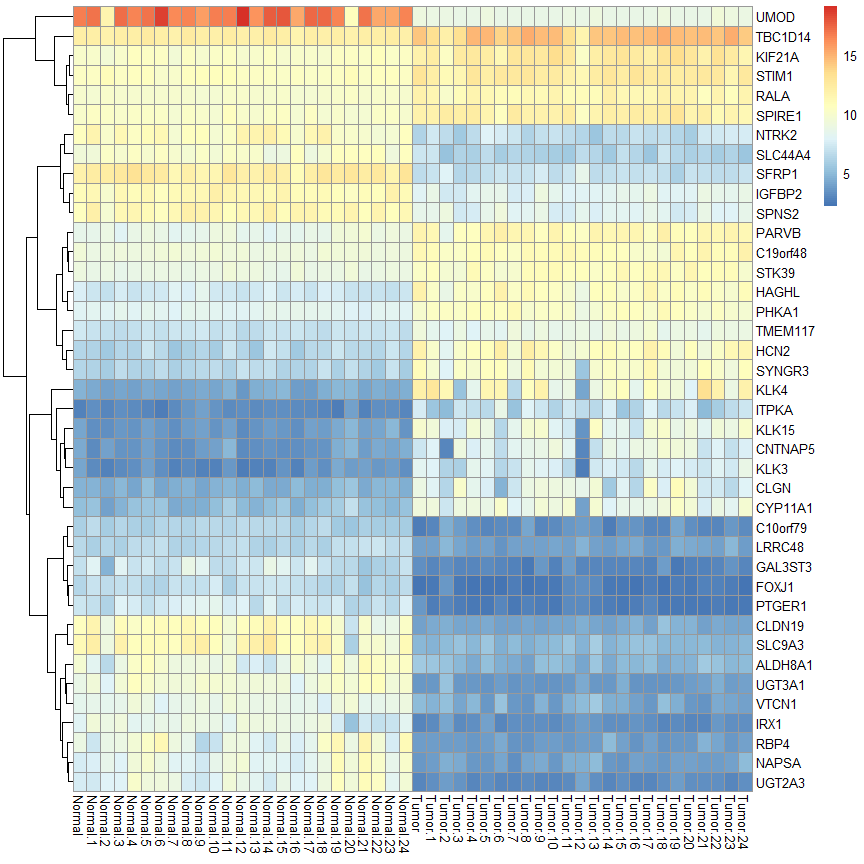

### rlog scaled

Erzeugung einer rlog\_scaled Matrix:

``` r
data_frame_merge_rlog_scaled <- t(scale(t(data_frame_merge_rlog), 
                                        center = T, 
                                        scale =T))
```

Erzeugung der Heatmap

``` r
#Plot
data_frame_merge_rlog_scaled  %>%
  pheatmap(cluster_cols = F)
```


``` r
# Definition of row clusters (not necessary, is already pheatmap default)
heatmap_rowClusters <- data_frame_merge_rlog_scaled %>%
  dist() %>%
  hclust()
```

``` r
#Plot
data_frame_merge_rlog_scaled %>%
  pheatmap(cluster_cols = F,
           cluster_rows = heatmap_rowClusters)
```


``` r
#Generate correlation matrix
rows_cor <- data_frame_merge_rlog_scaled %>%
  t() %>%
  cor() 
# Convert to distance
heatmap_rowClusters_cor <- as.dist(1-rows_cor) %>%
  hclust()
```

``` r
#Plot
data_frame_merge_rlog_scaled %>%
  pheatmap(cluster_cols = F,
           cluster_rows = heatmap_rowClusters_cor)
```

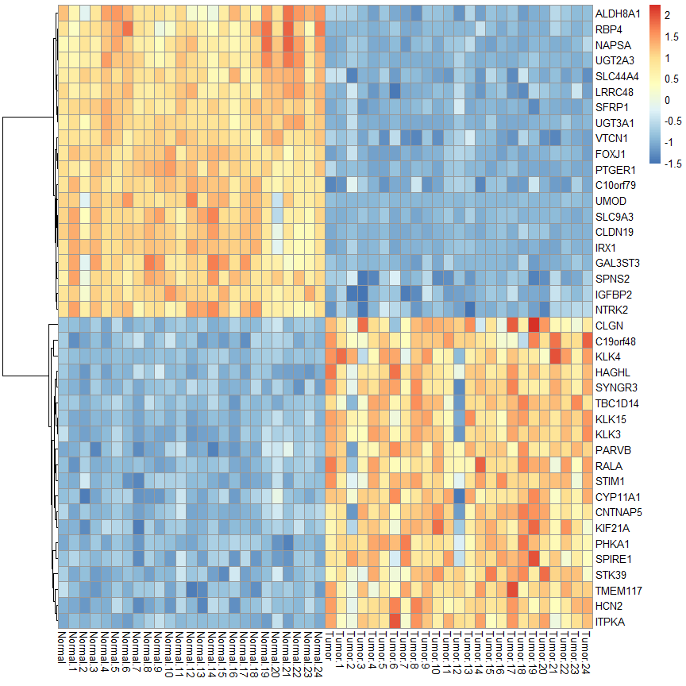

``` r
#Define breaks
symmetric_breaks <- seq(-max(abs(data_frame_merge_rlog_scaled)), 
                        max(abs(data_frame_merge_rlog_scaled)), 
                        length.out = 101)
```

``` r
# Cluster genes using "dendextend" dendrogramm
my_hclust_gene <- hclust(dist(data_frame_merge_rlog_scaled),
                         method = "complete")
 
# install if necessary
#install.packages("dendextend")
 
# load package
library(dendextend)
```

``` r
as.dendrogram(my_hclust_gene) %>%
  plot(horiz = TRUE)
```

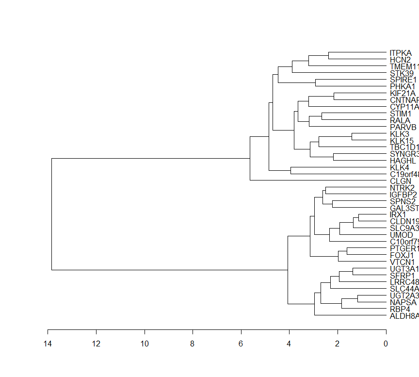

``` r
#Row annotation using dendrogramm:
my_gene_col <- cutree(tree = as.dendrogram(my_hclust_gene), k = 2)
#Cluster annotation (one or two)
my_gene_col <- data.frame(cluster = ifelse(test = my_gene_col == 1, 
                                           yes = "cluster 1", 
                                           no = "cluster 2"))
```

``` r
# Column annotation using Sample type
my_sample_col <- data.frame(Sample = rep(c("Normal", "Tumor"), c(25,25)))
row.names(my_sample_col) <- colnames(data_frame_merge_rlog_scaled)
```

``` r
#Create final Heatmap
pheatmap(data_frame_merge_rlog_scaled, 
         annotation_row = my_gene_col,
         annotation_col = my_sample_col,
         breaks = symmetric_breaks,
         cluster_cols = T,
         cutree_rows = 2,
         cutree_cols = 2)
```

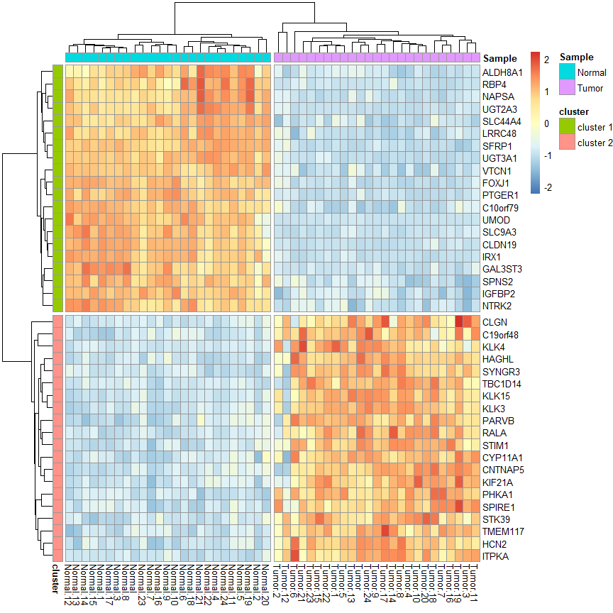

``` r
#Create final Heatmap pdf
pheatmap(data_frame_merge_rlog_scaled, 
         annotation_row = my_gene_col,
         annotation_col = my_sample_col,
         breaks = symmetric_breaks,
         cluster_cols = T,
         cutree_rows = 2,
         cutree_cols = 2,
         filename = "heatmap.pdf",
         width = 11.69,
         height = 8.27)
```

### Erklärung

Scaling (oder Standardization) transformiert die Daten, der
Mean/Durchschnitt wird auf 0 und die Standard-Abweichung auf 1 gesetzt.
Dies entspricht den z scores. Dies eignet sich be Werten mit hoher
Varianz und Extremweren, da diese sonst die Heatmap dominieren (z.B.
UMOD Gen).

## Citations

``` r
citation("DESeq2")
```

    ## 
    ##   Love, M.I., Huber, W., Anders, S. Moderated estimation of fold change
    ##   and dispersion for RNA-seq data with DESeq2 Genome Biology 15(12):550
    ##   (2014)
    ## 
    ## Ein BibTeX-Eintrag für LaTeX-Benutzer ist
    ## 
    ##   @Article{,
    ##     title = {Moderated estimation of fold change and dispersion for RNA-seq data with DESeq2},
    ##     author = {Michael I. Love and Wolfgang Huber and Simon Anders},
    ##     year = {2014},
    ##     journal = {Genome Biology},
    ##     doi = {10.1186/s13059-014-0550-8},
    ##     volume = {15},
    ##     issue = {12},
    ##     pages = {550},
    ##   }

``` r
citation("EnhancedVolcano")
```

    ## 
    ## To cite package 'EnhancedVolcano' in publications use:
    ## 
    ##   Kevin Blighe, Sharmila Rana and Myles Lewis (2021). EnhancedVolcano:
    ##   Publication-ready volcano plots with enhanced colouring and labeling.
    ##   R package version 1.12.0.
    ##   https://github.com/kevinblighe/EnhancedVolcano
    ## 
    ## Ein BibTeX-Eintrag für LaTeX-Benutzer ist
    ## 
    ##   @Manual{,
    ##     title = {EnhancedVolcano: Publication-ready volcano plots with enhanced colouring and
    ## labeling},
    ##     author = {Kevin Blighe and Sharmila Rana and Myles Lewis},
    ##     year = {2021},
    ##     note = {R package version 1.12.0},
    ##     url = {https://github.com/kevinblighe/EnhancedVolcano},
    ##   }

## Session info

``` r
sessionInfo()
```

    ## R version 4.1.2 (2021-11-01)
    ## Platform: x86_64-w64-mingw32/x64 (64-bit)
    ## Running under: Windows 10 x64 (build 19042)
    ## 
    ## Matrix products: default
    ## 
    ## locale:
    ## [1] LC_COLLATE=German_Germany.1252  LC_CTYPE=German_Germany.1252   
    ## [3] LC_MONETARY=German_Germany.1252 LC_NUMERIC=C                   
    ## [5] LC_TIME=German_Germany.1252    
    ## 
    ## attached base packages:
    ## [1] stats4    stats     graphics  grDevices utils     datasets  methods  
    ## [8] base     
    ## 
    ## other attached packages:
    ##  [1] dendextend_1.15.2           pheatmap_1.0.12            
    ##  [3] EnhancedVolcano_1.12.0      openxlsx_4.2.4             
    ##  [5] glmpca_0.2.0                DESeq2_1.34.0              
    ##  [7] SummarizedExperiment_1.24.0 Biobase_2.54.0             
    ##  [9] MatrixGenerics_1.6.0        matrixStats_0.61.0         
    ## [11] GenomicRanges_1.46.1        GenomeInfoDb_1.30.0        
    ## [13] IRanges_2.28.0              S4Vectors_0.32.3           
    ## [15] BiocGenerics_0.40.0         forcats_0.5.1              
    ## [17] stringr_1.4.0               purrr_0.3.4                
    ## [19] tidyverse_1.3.1             tidyr_1.1.4                
    ## [21] FactoMineR_2.4              readr_2.1.1                
    ## [23] tibble_3.1.6                dplyr_1.0.7                
    ## [25] genefilter_1.76.0           ggrepel_0.9.1              
    ## [27] ggplot2_3.3.5               BiocManager_1.30.16        
    ## 
    ## loaded via a namespace (and not attached):
    ##   [1] ggbeeswarm_0.6.0       colorspace_2.0-2       ellipsis_0.3.2        
    ##   [4] XVector_0.34.0         fs_1.5.1               rstudioapi_0.13       
    ##   [7] farver_2.1.0           DT_0.20                bit64_4.0.5           
    ##  [10] AnnotationDbi_1.56.2   fansi_0.5.0            lubridate_1.8.0       
    ##  [13] xml2_1.3.3             splines_4.1.2          leaps_3.1             
    ##  [16] extrafont_0.17         cachem_1.0.6           geneplotter_1.72.0    
    ##  [19] knitr_1.36             jsonlite_1.7.2         Rttf2pt1_1.3.9        
    ##  [22] broom_0.7.10           annotate_1.72.0        cluster_2.1.2         
    ##  [25] dbplyr_2.1.1           png_0.1-7              compiler_4.1.2        
    ##  [28] httr_1.4.2             backports_1.4.0        assertthat_0.2.1      
    ##  [31] Matrix_1.3-4           fastmap_1.1.0          cli_3.1.0             
    ##  [34] htmltools_0.5.2        tools_4.1.2            gtable_0.3.0          
    ##  [37] glue_1.5.1             GenomeInfoDbData_1.2.7 maps_3.4.0            
    ##  [40] Rcpp_1.0.7             cellranger_1.1.0       vctrs_0.3.8           
    ##  [43] Biostrings_2.62.0      ggalt_0.4.0            extrafontdb_1.0       
    ##  [46] xfun_0.28              rvest_1.0.2            lifecycle_1.0.1       
    ##  [49] XML_3.99-0.8           zlibbioc_1.40.0        MASS_7.3-54           
    ##  [52] scales_1.1.1           ragg_1.2.1             hms_1.1.1             
    ##  [55] proj4_1.0-10.1         parallel_4.1.2         RColorBrewer_1.1-2    
    ##  [58] yaml_2.2.1             gridExtra_2.3          memoise_2.0.1         
    ##  [61] ggrastr_1.0.1          stringi_1.7.6          RSQLite_2.2.9         
    ##  [64] highr_0.9              zip_2.2.0              BiocParallel_1.28.2   
    ##  [67] rlang_0.4.12           pkgconfig_2.0.3        systemfonts_1.0.3     
    ##  [70] bitops_1.0-7           evaluate_0.14          lattice_0.20-45       
    ##  [73] htmlwidgets_1.5.4      labeling_0.4.2         bit_4.0.4             
    ##  [76] tidyselect_1.1.1       magrittr_2.0.1         R6_2.5.1              
    ##  [79] generics_0.1.1         DelayedArray_0.20.0    DBI_1.1.1             
    ##  [82] pillar_1.6.4           haven_2.4.3            withr_2.4.3           
    ##  [85] ash_1.0-15             survival_3.2-13        KEGGREST_1.34.0       
    ##  [88] scatterplot3d_0.3-41   RCurl_1.98-1.5         modelr_0.1.8          
    ##  [91] crayon_1.4.2           KernSmooth_2.23-20     utf8_1.2.2            
    ##  [94] tzdb_0.2.0             rmarkdown_2.11         viridis_0.6.2         
    ##  [97] locfit_1.5-9.4         grid_4.1.2             readxl_1.3.1          
    ## [100] blob_1.2.2             reprex_2.0.1           digest_0.6.28         
    ## [103] flashClust_1.01-2      xtable_1.8-4           textshaping_0.3.6     
    ## [106] munsell_0.5.0          viridisLite_0.4.0      beeswarm_0.4.0        
    ## [109] vipor_0.4.5
